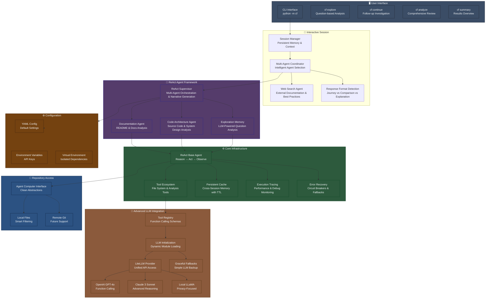
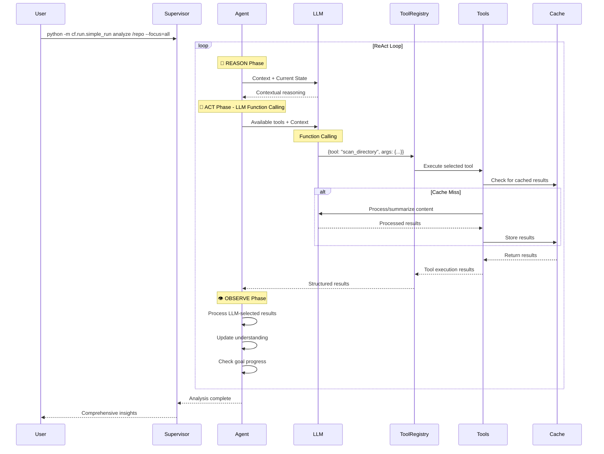

# CodeFusion Interactive Code Intelligence

An **interactive, multi-agent LLM-powered system** for intelligent codebase exploration and analysis. CodeFusion provides continuous question-answer sessions with persistent memory, web search integration, and adaptive response formats tailored to different types of technical questions.

## 🧠 ReAct Architecture Overview



## 🎯 Core Features

### ✅ **ReAct Pattern Implementation**
- **Systematic Reasoning**: AI-powered analysis of current state and goal progress
- **Intelligent Action Selection**: 8 specialized tools for comprehensive code exploration
- **Adaptive Observation**: Learning from results to improve future actions
- **Goal-Oriented Loops**: Iterative refinement until objectives are achieved

### ✅ **Interactive Multi-Agent Architecture**
- **Interactive Session Manager**: Maintains persistent memory and context across questions
- **Multi-Agent Coordinator**: Intelligently selects and coordinates specialized agents based on question type
- **Documentation Agent**: Analyzes README files, guides, and documentation
- **Code Architecture Agent**: Examines source code, functions, patterns, and system design  
- **Web Search Agent**: Integrates external documentation and best practices using DuckDuckGo API
- **Supervisor Agent**: Orchestrates agents and generates unified responses using LLM consolidation

### ✅ **Advanced LLM Integration**
- **Multiple Providers**: OpenAI, Anthropic, LLaMA via LiteLLM
- **LLM Function Calling**: AI selects tools by generating structured output
- **Intelligent Reasoning**: Context-aware decision making for exploration strategy
- **Dynamic Tool Selection**: LLM chooses optimal tools based on current state and goals
- **Robust Fallbacks**: Graceful degradation when LLMs unavailable
- **Provider-Specific Optimization**: Tailored prompts for each model

### ✅ **Adaptive Response Formats**
- **Journey Format (Life of X)**: For process flow and system architecture questions
- **Comparison Format**: For performance comparisons and technical trade-off analysis  
- **Explanation Format**: For conceptual explanations and configuration questions
- **LLM-Driven Format Detection**: Automatically selects optimal response format based on question type
- **Web Search Integration**: External insights woven naturally into responses, not shown separately

### ✅ **Enterprise-Grade Infrastructure**
- **Persistent Caching**: Cross-session memory with TTL and LRU eviction
- **Comprehensive Tracing**: Execution monitoring and performance metrics
- **Error Recovery**: Circuit breakers, retry logic, and fallback strategies
- **Configurable Performance**: Fast, balanced, and thorough analysis profiles

## 🚀 Quick Start

### Installation & Setup

```bash
# 1. Create and activate virtual environment (REQUIRED)
python -m venv venv
source venv/bin/activate  # On Windows: venv\Scripts\activate

# 2. Install CodeFusion
pip install -e .

# 3. Install LLM support (required for full AI features)
pip install litellm

# 4. Set up API key (choose one)
export OPENAI_API_KEY="your-openai-api-key"     # For GPT-4
export ANTHROPIC_API_KEY="your-anthropic-key"   # For Claude
# OR edit config/default/config.yaml directly

# 5. Verify installation
python -m cf explore --help
```

### Basic Usage

```bash
# Interactive exploration with persistent memory
python -m cf explore /path/to/repo "How does FastAPI routing work?"
# Follows up with: "What is the performance implication of using async def vs. def?"
# System remembers previous context and provides comparative analysis

# Start interactive session for continuous Q&A
python -m cf interactive /path/to/repo
# > How does authentication work?
# > What are the security implications?
# > Show me code examples

# Single question with multi-agent coordination
python -m cf explore /path/to/repo "Explain the relationship between FastAPI and Starlette"
# Uses 3 agents: code analysis, documentation, web search
```

### Advanced Usage

```bash
# Different response formats based on question type
python -m cf explore /path/to/repo "How does routing work?"  # Journey format
python -m cf explore /path/to/repo "async def vs def performance?"  # Comparison format
python -m cf explore /path/to/repo "What is dependency injection?"  # Explanation format

# Web search integration for external context
export ENABLE_WEB_SEARCH=true
python -m cf explore /path/to/repo "FastAPI best practices for production"

# Use with custom configuration
python -m cf explore /path/to/repo "question" --config=custom-config.yaml
```

### LLM Configuration
# OpenAI Integration
export CF_LLM_MODEL=gpt-4
export CF_LLM_API_KEY=your-openai-api-key

# Anthropic Integration
export CF_LLM_MODEL=claude-3-sonnet-20240229
export CF_LLM_API_KEY=your-anthropic-api-key

# LLaMA Integration (via Together AI)
export CF_LLM_MODEL=together_ai/meta-llama/Llama-2-7b-chat-hf
export CF_LLM_API_KEY=your-together-ai-key

# Run analysis with LLM
python -m cf.run.simple_run analyze /repo --focus=all
```

## 🔄 ReAct Process Flow

The framework follows a systematic **Reason → Act → Observe** cycle:



## 🛠️ LLM Function Calling Tool Ecosystem

Each ReAct agent uses **LLM Function Calling** where the AI selects tools by generating structured output:

### Core Exploration Tools (LLM-Selected)
- **🔍 SCAN_DIRECTORY**: Recursive directory structure exploration
- **📋 LIST_FILES**: Pattern-based file discovery  
- **📖 READ_FILE**: Intelligent file content analysis
- **🔎 SEARCH_FILES**: Multi-file pattern searching

### Advanced Analysis Tools (LLM-Selected)
- **⚙️ ANALYZE_CODE**: Code structure and complexity analysis
- **📝 GENERATE_SUMMARY**: Intelligent content summarization

### How LLM Function Calling Works
1. **Context Provision**: Agent provides current state and available tools to LLM
2. **Tool Selection**: LLM analyzes context and selects optimal tool with parameters
3. **Structured Output**: LLM generates JSON with tool name and arguments
4. **Execution**: Tool Registry executes the selected tool with LLM-chosen parameters
5. **Adaptive Learning**: Results inform future tool selection decisions

```json
// Example LLM Tool Selection
{
  "tool_calls": [
    {
      "function_name": "search_files",
      "arguments": {
        "pattern": "*.py",
        "file_types": [".py"],
        "max_results": 20
      }
    }
  ]
}
```

## 🎛️ Configuration & Performance

### Environment Variables
```bash
# ReAct Loop Configuration
CF_REACT_MAX_ITERATIONS=20          # Maximum iterations per agent
CF_REACT_ITERATION_TIMEOUT=30.0     # Timeout per iteration (seconds)
CF_REACT_TOTAL_TIMEOUT=600.0        # Total analysis timeout

# Caching Configuration
CF_REACT_CACHE_ENABLED=true         # Enable persistent caching
CF_REACT_CACHE_MAX_SIZE=1000        # Maximum cache entries
CF_REACT_CACHE_TTL=3600             # Cache TTL (seconds)

# Tracing Configuration
CF_REACT_TRACING_ENABLED=true       # Enable execution tracing
CF_REACT_TRACE_DIR=./traces         # Trace output directory

# Error Handling
CF_REACT_ERROR_RECOVERY=true        # Enable error recovery
CF_REACT_MAX_CONSECUTIVE_ERRORS=3   # Circuit breaker threshold
```

### Performance Profiles
```bash
# Fast Analysis (10 iterations, 15s timeout)
CF_REACT_MAX_ITERATIONS=10 python -m cf.run.simple_run analyze /repo --focus=all

# Thorough Analysis (50 iterations, 60s timeout)  
CF_REACT_MAX_ITERATIONS=50 python -m cf.run.simple_run analyze /repo --focus=all

# Custom Configuration
CF_REACT_MAX_ITERATIONS=30 CF_REACT_CACHE_MAX_SIZE=2000 python -m cf.run.simple_run analyze /repo
```

## 📊 Example Interactive Session

### Journey Format Example
```
🎯 Life of Routing: A Journey Through the System
======================================================================

🏗️ **Architecture & Flow:** When an HTTP request arrives at `/api/users/{user_id}`, 
FastAPI's routing system springs into action. The journey begins in main.py where the 
FastAPI application instance routes the request through its internal ASGI middleware 
stack, ultimately reaching the path operation function that handles user retrieval.

🛤️ **Technical Flow:** The process follows this path:
   **1. Request Reception:** FastAPI receives the HTTP request and parses the URL path 
   **2. Route Matching:** The router in routing.py:156 matches `/api/users/{user_id}` pattern
   **3. Path Parameter Extraction:** FastAPI extracts `user_id` from the URL path
   **4. Dependency Resolution:** The dependency injection system resolves UserService
   **5. Handler Execution:** The get_user() function in api/users.py:45 processes the request

💻 **Code Examples:** Implementation details:
   • In main.py:23: @app.get('/api/users/{user_id}') async def get_user(user_id: int)
   • In api/users.py:45: return await UserService.get_by_id(user_id)

📈 ⏱️  Response time: 28.3s | 🤖 Agents used: 3 | 💾 Cache hits: 2
```

### Comparison Format Example  
```
🔍 Technical Comparison Analysis: async def vs def performance implications
======================================================================

📊 **Analysis:** In FastAPI applications, the choice between `async def` and `def` 
for path operation functions significantly impacts performance and concurrency handling.

⚖️ **Key Comparisons:**

   **Performance:**
   • async def: Non-blocking I/O operations, handles 1000+ concurrent requests efficiently
   • def: Blocking operations, limited to thread pool size (~40 concurrent requests)
   • Recommendation: Use async def for I/O-heavy operations, def for CPU-intensive tasks

   **Memory Usage:**
   • async def: Lower memory footprint due to coroutines vs threads
   • def: Higher memory usage due to thread overhead (8MB per thread)
   • Recommendation: async def for high-concurrency applications

💻 **Code Examples:**
   • async def get_user(user_id: int): return await db.fetch_user(user_id)  # Non-blocking
   • def get_user_sync(user_id: int): return db.fetch_user_sync(user_id)    # Blocking

⚡ **Performance Insights:**
   • async def can handle 10x more concurrent connections with same resources
   • CPU-bound tasks should use def to avoid blocking the event loop

🎯 **Conclusion:** Use async def for I/O operations and def for CPU-intensive tasks

📈 **Analysis Confidence:** 92.5%
```

### Interactive Memory Example
```
Session: /path/to/fastapi-project (Started: 2024-01-15 14:30)

You: How does FastAPI routing work?
🤖 [Journey format response about routing...]

You: What about async def vs def performance?  
🤖 [Comparison format response, remembering routing context...]

You: Show me middleware examples
🤖 [Journey format showing middleware flow, building on routing knowledge...]

💾 Session Memory: 3 questions | 🧠 Context: routing, performance, middleware
```

## 🔧 Advanced Usage

### Python API

```python
from cf.core.interactive_session import InteractiveSessionManager
from cf.aci.repo import LocalCodeRepo
from cf.config import CfConfig

# Create interactive session
repo = LocalCodeRepo("/path/to/repo")
config = CfConfig()
session = InteractiveSessionManager(repo, config)

# Start interactive session with persistent memory
session.start_interactive_session()

# Ask questions programmatically
response = session.ask_question("How does routing work?")
print(response['narrative'])

# Follow-up questions remember context
response2 = session.ask_question("What about async performance?")
print(response2['comparison_analysis'])

# Access session memory
memories = session.get_session_memories()
context = session.get_session_context()

# Multi-agent coordination for complex questions
from cf.tools import should_consolidate_multi_agent_results, generate_llm_driven_narrative

question = "Explain FastAPI and Starlette relationship"
if should_consolidate_multi_agent_results(question):
    # Run all 3 agents: code, docs, web search
    code_results = session.supervisor.explore_repository(goal=question, focus="code")
    docs_results = session.supervisor.explore_repository(goal=question, focus="docs") 
    web_results = session.web_search_agent.search_for_question(question)
    
    # Consolidate with LLM
    unified_response = generate_llm_driven_narrative(question, code_results, docs_results, web_results)
```

### Custom Agent Development

```python
from cf.core.react_agent import ReActAgent, ReActAction, ActionType

class SecurityAnalysisAgent(ReActAgent):
    def reason(self) -> str:
        if not self.state.observations:
            return "Start by scanning for security-related files"
        return "Search for potential security vulnerabilities"
    
    def plan_action(self, reasoning: str) -> ReActAction:
        if "scan" in reasoning.lower():
            return ReActAction(
                action_type=ActionType.SEARCH_FILES,
                description="Find security-related files",
                parameters={'pattern': 'auth|security|crypto', 'file_types': ['.py']}
            )
        # ... additional action planning
    
    def _generate_summary(self) -> str:
        return f"Security analysis complete: {len(self.state.observations)} findings"
```

## 📈 Monitoring & Debugging

### Execution Tracing
```bash
# Enable detailed tracing
CF_REACT_TRACING_ENABLED=true CF_REACT_TRACE_DIR=./traces python -m cf.run.simple_run analyze /repo

# View trace files
ls -la ./traces/
cat ./traces/trace_12345_supervisor.json
```

### Performance Monitoring
```python
from cf.core.react_tracing import tracer

# Get global metrics
metrics = tracer.get_global_metrics()
print(f"Total sessions: {metrics['total_sessions']}")
print(f"Average duration: {metrics['avg_session_duration']:.2f}s")
print(f"Success rate: {(1 - metrics['total_errors']/metrics['total_sessions']):.2%}")
```

### Debug Mode
```bash
# Enable verbose debugging
CF_REACT_LOG_LEVEL=DEBUG CF_REACT_VERBOSE_LOGGING=true python -m cf.run.simple_run analyze /repo

# Disable caching for testing
CF_REACT_CACHE_ENABLED=false python -m cf.run.simple_run analyze /repo
```

## 🆚 Why ReAct Framework?

### Traditional Code Analysis Tools
- ❌ Static analysis with limited context
- ❌ One-time indexing without adaptation
- ❌ No reasoning about findings
- ❌ Limited multi-perspective analysis

### CodeFusion ReAct Framework
- ✅ Dynamic, adaptive exploration
- ✅ AI-powered reasoning and decision making
- ✅ Multi-agent collaborative analysis
- ✅ Persistent learning across sessions
- ✅ Comprehensive error recovery
- ✅ Configurable depth and focus

## 📚 Documentation

- [**Architecture Guide**](./docs/dev/architecture.md) - Detailed system architecture
- [**ReAct Framework Documentation**](./docs/react-framework.md) - Complete framework guide
- [**Configuration Reference**](./docs/usage/configuration.md) - All configuration options
- [**CLI Usage**](./docs/usage/cli.md) - Command line interface guide

## 🧪 Testing

```bash
# Run comprehensive test suite
pytest tests/test_react_framework.py -v

# Test specific components
pytest tests/test_react_framework.py::TestReActAgent -v

# Run with coverage
pytest tests/test_react_framework.py --cov=cf.core --cov=cf.agents
```

## 🤝 Contributing

We welcome contributions that enhance the ReAct framework:

1. **Maintain ReAct Principles**: Preserve the Reason → Act → Observe pattern
2. **Add Specialized Agents**: Create domain-specific analysis agents
3. **Extend Tool Ecosystem**: Add new tools for enhanced capabilities
4. **Improve LLM Integration**: Support additional providers and models
5. **Enhance Error Recovery**: Strengthen resilience and fault tolerance

## 🆕 Key Interactive Features (v0.2+)

### ✅ **Interactive Session Management**
- **Persistent Memory**: Remembers previous questions and context across session
- **Session State**: Maintains conversation history and learned insights
- **Context Building**: Each question builds upon previous understanding

### ✅ **Multi-Agent Coordination**  
- **Intelligent Agent Selection**: LLM determines which agents are needed per question
- **3-Agent System**: Code analysis, documentation analysis, web search agents
- **Result Consolidation**: LLM weaves together insights from all agents

### ✅ **Adaptive Response Formats**
- **Smart Format Detection**: LLM analyzes question type and selects optimal format
- **Journey Format**: For process flows and system architecture (Life of X)
- **Comparison Format**: For performance analysis and technical trade-offs
- **Explanation Format**: For conceptual questions and configurations

### ✅ **Web Search Integration**
- **External Knowledge**: DuckDuckGo API integration for best practices and documentation
- **Seamless Integration**: Web insights woven into main narrative, not shown separately
- **LLM-Powered Search Queries**: Intelligent search query generation based on context

## 🔮 Roadmap

### Upcoming Features
- **Session Persistence**: Save and restore sessions across CLI restarts
- **Multi-Repository Sessions**: Handle multiple codebases in one session
- **Advanced Memory**: Semantic similarity-based memory retrieval
- **Plugin Architecture**: Dynamic agent and tool loading
- **Parallel Tool Execution**: Concurrent action execution for faster analysis

### LLM Integration Enhancements
- **Model Switching**: Dynamic model selection based on task complexity
- **Context Window Management**: Intelligent truncation and summarization
- **Cost Optimization**: Efficient token usage and provider selection
- **Streaming Responses**: Real-time response generation for interactive mode"}

## 📜 License

Apache 2.0 License

---

*Built on the ReAct pattern for systematic, intelligent code exploration through reasoning, acting, and observing.*