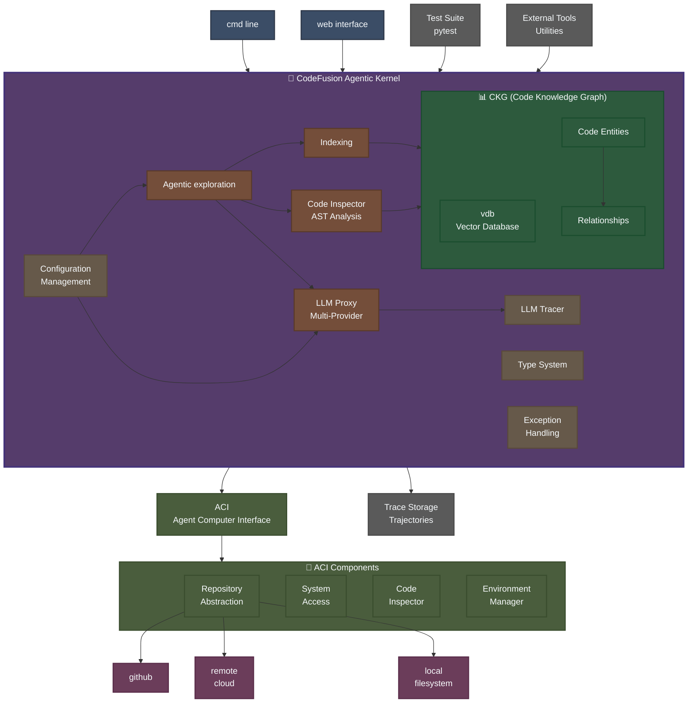

# CodeFusion

A code understanding tool designed to help senior developers quickly ramp up on large, unfamiliar codebases through agentic exploration and automated knowledge base creation.

## Architecture Overview



### 🏗️ **System Architecture**

The CodeFusion architecture follows a **kernel-based design** with clear separation of concerns:

#### 🎯 **User Interfaces**
- **cmd line**: Command-line interface for developer interaction
- **web interface**: Browser-based interface for visual exploration

#### 🧠 **CodeFusion Agentic Kernel**
The central processing unit containing:
- **Agentic exploration**: Multi-strategy code exploration (ReAct, Plan-Act, Sense-Act)
- **Indexing**: Systematic codebase processing and analysis
- **Code Inspector**: AST-based code analysis and pattern detection
- **LLM Proxy**: Multi-provider LLM integration with tracing
- **Support Systems**: Configuration, type system, and exception handling

#### 🔌 **ACI (Agent Computer Interface)**
Unified interface layer between agents and computer system:
- **Repository Access**: Local/remote repository abstraction
- **System Interface**: Environment variables, command execution
- **Code Inspection**: AST-based code analysis and pattern detection
- **Environment Management**: Search capabilities and resource management

#### 📊 **Code Knowledge Graph (CKG)**
- **Vector Database (vdb)**: Semantic embeddings for code similarity and search
- **Code Entities**: Files, classes, functions with metadata
- **Relationships**: Import dependencies, call graphs, inheritance
- **C4 Mapping**: Context, Container, Components, Code levels

#### 🏗️ **Supporting Infrastructure**
- **Test Suite**: Comprehensive pytest-based testing framework
- **Trace Storage**: Execution trajectories and performance metrics  
- **External Tools**: Utility scripts and development aids
- **Type System**: Comprehensive type definitions and protocols
- **Exception Handling**: Custom exception hierarchy for robust error management

## Workflow

For detailed step-by-step component interactions and workflows, see [Workflow Diagrams](docs/dev/workflow.md).

## Component Overview

### 🎯 **User Interfaces**
- **RunCli**: Command-line interface for interactive exploration
- **RunApi**: REST API for programmatic access (future)

### ⚙️ **Core System**
- **CfConfig**: YAML/JSON configuration management
- **ACI**: Agent Computer Interface with system access and repository abstraction

### 🧠 **Knowledge Management**
- **CodeKB**: Knowledge graph for C4 mapping (Context, Container, Components, Code)
- **Content Analyzer**: Intelligent question answering and content analysis
- **Relationship Detector**: AST-based relationship detection
- **Vector Storage**: FAISS-based semantic search
- **Neo4j**: Graph database for complex relationships

### 🤖 **Agentic Exploration**
- **CodeIndexer**: Orchestrates exploration strategies
- **ReAct Agent**: Reasoning + Acting approach with LLM integration
- **Plan-then-Act**: Strategic planning followed by systematic execution
- **Sense-then-Act**: Iterative environment sensing and adaptive actions

### 🔗 **LLM Integration**
- **LlmModel**: Multi-provider model interface via LiteLLM
- **LlmTracer**: Monitoring and observability
- **Provider Support**: OpenAI, Anthropic, Cohere, local models

## V0.01 Goals

1. **Index Codebase**: Given a repository path, perform initial exploration
2. **Build Knowledge Base**: Create structured understanding of code architecture
3. **Answer Questions**: Respond to queries about code structure and functionality

## Key Features

- 🚀 **Rapid Onboarding**: Quick understanding of large codebases
- 🔍 **Multi-Strategy Exploration**: ReAct, Plan-Act, Sense-Act approaches
- 📊 **Technology Detection**: Automatic identification of frameworks and patterns
- 🌐 **External Integration**: Web search and documentation lookup
- 📈 **Extensible Architecture**: Plugin-ready for new exploration strategies

## Installation

### Prerequisites
- Python 3.8 or higher
- Git

### Setup

```bash
# Clone the repository
git clone <repository-url>
cd codefusion

# Create and activate virtual environment
python -m venv venv
source venv/bin/activate  # On Windows: venv\Scripts\activate

# Install base dependencies
pip install -e .

# Install optional dependencies (choose what you need)
pip install -e ".[vector]"    # For vector database and semantic search
pip install -e ".[llm]"       # For LLM integration
pip install -e ".[neo4j]"     # For Neo4j graph database
pip install -e ".[dev]"       # For development tools
pip install -e ".[all]"       # Install everything

# Verify installation
python -m cf --help
```

### Dependencies Overview

- **Base**: Core functionality with text-based knowledge base
- **Vector**: Adds FAISS + sentence-transformers for semantic search  
- **LLM**: LiteLLM integration for multiple AI providers
- **Neo4j**: Graph database for complex relationship analysis
- **Dev**: Testing, linting, and development tools

## Quick Start

### CLI Usage

```bash
# Activate virtual environment
source venv/bin/activate

# Explore a codebase with text-based knowledge base
cf explore /path/to/codebase

# Use vector database for semantic search
cf explore /path/to/codebase --config vector_config.yaml

# Query the knowledge base
cf query "What classes are in this codebase?"

# View knowledge base statistics
cf stats
```

### Python API

```python
from cf import CfConfig
from cf.aci import LocalCodeRepo, EnvironmentManager

# Configure the system
config = CfConfig.from_file("config.yaml")

# Initialize repository
repo = LocalCodeRepo("/path/to/target/codebase")

# Create environment manager
env = EnvironmentManager(repo, config)

# Get repository overview
overview = env.get_repository_overview()
print(f"Primary language: {overview['primary_language']}")

# Get exploration suggestions
suggestions = env.suggest_exploration_strategy()
for suggestion in suggestions:
    print(f"💡 {suggestion}")
```

### Configuration Examples

**Basic config (config.yaml):**
```yaml
kb_type: "text"
kb_path: "./kb"
exploration_strategy: "react"
```

**Vector database config:**
```yaml
kb_type: "vector"
kb_path: "./kb_vector"
embedding_model: "all-MiniLM-L6-v2"
exploration_strategy: "react"
```

## Development Status

- ✅ Core architecture implemented
- ✅ Configuration management (YAML-based)
- ✅ Repository abstraction (local/remote)
- ✅ Environment with search capabilities
- ✅ Knowledge base implementation (text + Neo4j ready)
- ✅ Agentic indexer (ReAct strategy)
- ✅ LLM integration (LiteLLM + tracing)
- ✅ CLI interface (demo, index, query, explore)
- ✅ Code inspector (AST analysis)
- ✅ Type system and exception handling
- ✅ Test framework (pytest)
- ✅ Python packaging (pyproject.toml)
- ✅ Vector database integration (FAISS + sentence-transformers)
- ✅ Advanced relationship detection (AST-based analysis)
- ✅ Neo4j graph database support (with fallback)
- ✅ Plan-then-Act and Sense-then-Act strategies
- ✅ Agent Computer Interface (ACI) with system access
- ✅ Content analysis and intelligent question answering
- 🚧 Web interface

## Contributing

This project is in early development. Architecture feedback and contributions welcome!

## License

Apache 2.0 License
