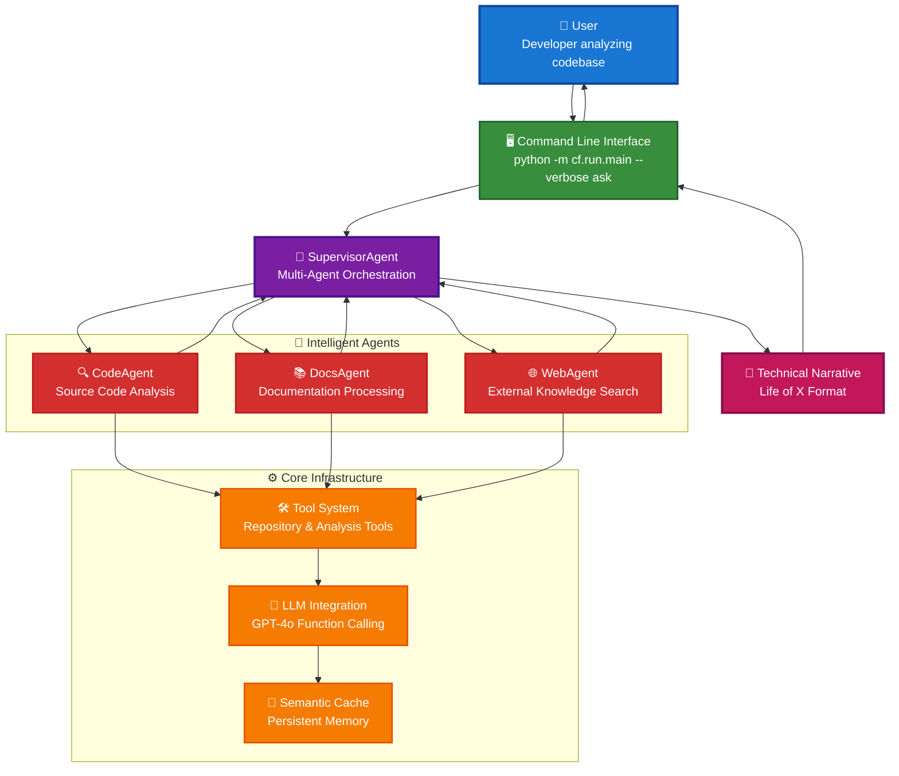
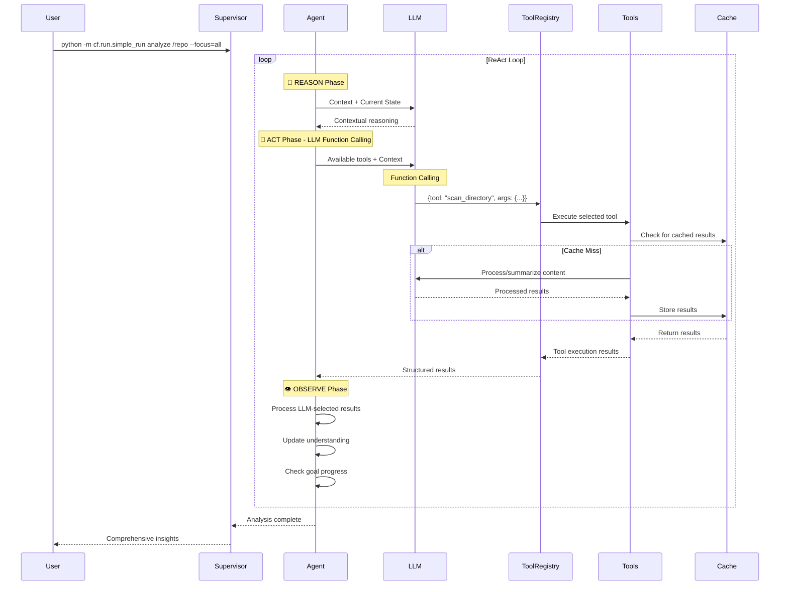

# CodeFusion - AI-Powered Codebase Analysis

An **intelligent multi-agent system** for deep codebase exploration and analysis. CodeFusion uses LLM-driven function calling and verbose logging to provide comprehensive technical narratives about how systems work.

## 🏗️ System Architecture


```mermaid
graph TB
    %% User Layer
    User[👤 User<br/>Developer analyzing codebase]
    
    %% Interface Layer
    CLI[🖥️ Command Line Interface<br/>python -m cf.run.main --verbose ask]
    
    %% Core System
    Supervisor[🤖 SupervisorAgent<br/>Multi-Agent Orchestration]
    
    %% Specialized Agents
    subgraph Agents ["🎯 Intelligent Agents"]
        CodeAgent[🔍 CodeAgent<br/>Source Code Analysis]
        DocsAgent[📚 DocsAgent<br/>Documentation Processing]
        WebAgent[🌐 WebAgent<br/>External Knowledge Search]
    end
    
    %% Infrastructure
    subgraph Infrastructure ["⚙️ Core Infrastructure"]
        Tools[🛠️ Tool System<br/>Repository & Analysis Tools]
        LLM[🧠 LLM Integration<br/>GPT-4o Function Calling]
        Cache[💾 Semantic Cache<br/>Persistent Memory]
    end
    
    %% Output
    Narrative[📖 Technical Narrative<br/>Life of X Format]
    
    %% Flow
    User --> CLI
    CLI --> Supervisor
    Supervisor --> CodeAgent
    Supervisor --> DocsAgent
    Supervisor --> WebAgent
    
    CodeAgent --> Tools
    DocsAgent --> Tools
    WebAgent --> Tools
    
    Tools --> LLM
    LLM --> Cache
    
    CodeAgent --> Supervisor
    DocsAgent --> Supervisor
    WebAgent --> Supervisor
    
    Supervisor --> Narrative
    Narrative --> CLI
    CLI --> User
    
    %% Clean styling with good contrast
    classDef user fill:#1976d2,stroke:#0d47a1,stroke-width:3px,color:#fff
    classDef interface fill:#388e3c,stroke:#1b5e20,stroke-width:2px,color:#fff
    classDef core fill:#7b1fa2,stroke:#4a148c,stroke-width:3px,color:#fff
    classDef agents fill:#d32f2f,stroke:#b71c1c,stroke-width:2px,color:#fff
    classDef infra fill:#f57c00,stroke:#e65100,stroke-width:2px,color:#fff
    classDef output fill:#c2185b,stroke:#880e4f,stroke-width:3px,color:#fff
    
    class User user
    class CLI interface
    class Supervisor core
    class CodeAgent,DocsAgent,WebAgent agents
    class Tools,LLM,Cache infra
    class Narrative output
```

> **📋 For detailed workflow diagrams and system execution flow, see [Architecture Documentation](docs/dev/architecture.md#system-workflow-overview)**

## 🎯 Current Features

### ✅ **Multi-Agent Coordination**
- **SupervisorAgent**: Orchestrates 3 specialized agents and synthesizes responses
- **CodeAgent**: Deep code analysis using LLM function calling loops
- **DocsAgent**: Documentation analysis and README parsing
- **WebAgent**: Web search integration for external knowledge
- **Response Time Tracking**: Accurate execution time measurement (fixed from 0.0s issue)

### ✅ **LLM Function Calling System**
- **Conversation History**: Multi-turn dialogue with context preservation
- **Dynamic Tool Selection**: LLM intelligently selects tools with parameters
- **Tool Registry**: Schema-based tool management and dispatch
- **Available Tools**: `scan_directory`, `read_file`, `search_files`, `analyze_code`, `web_search`

### ✅ **Verbose Logging System**
- **Action Planning Phases**: Shows agent reasoning and decision making
- **Tool Selection Logging**: Displays which tools LLM selects and why
- **Progress Tracking**: Real-time visibility into agent activity
- **Dual Logging**: Technical debug logs + user-friendly verbose output

### ✅ **Technical Narrative Generation**
- **Architectural Overview**: Comprehensive technical stories about system components
- **Life of X Format**: Detailed narratives following features through entire systems
- **Code Pattern Recognition**: Identifies specific implementations, classes, and methods
- **Framework Integration**: Understands relationships between technologies (e.g., FastAPI + Starlette)

### ✅ **LLM Integration**
- **LiteLLM Support**: Multi-provider integration (OpenAI, Anthropic, LLaMA)
- **Primary Model**: GPT-4o with function calling capabilities
- **Configuration**: YAML config + environment variable support
- **API Key Management**: Secure credential handling

## 🚀 Quick Start

### Installation & Setup

```bash
# 1. Create and activate virtual environment (REQUIRED)
python -m venv .venv
source .venv/bin/activate  # On Windows: .venv\Scripts\activate

# 2. Install dependencies
pip install -e .

# 3. Set up API key (choose one method)
export OPENAI_API_KEY="your-openai-api-key"     # For GPT-4o
# OR edit cf/configs/config.yaml directly

# 4. Verify installation
python -m cf.run.main --help
```

### Neo4j Knowledge Base (Required for Full Functionality)

CodeFusion uses a **6-layer knowledge base architecture** that requires Neo4j for structural analysis:

1. **Repository Layer**: File system scanning and metadata
2. **Structural Layer**: AST-based code parsing (functions, classes, imports)
3. **Semantic Layer**: Code embeddings for similarity search
4. **Pattern Layer**: Design pattern and code smell detection
5. **Life-of-X Layer**: Execution path and data flow tracing
6. **Validation Layer**: Anti-hallucination fact verification

#### Why Neo4j?

Neo4j enables:
- **Graph-based code analysis**: Trace function calls, class hierarchies, import chains
- **Fast structural queries**: Find all classes implementing an interface, all functions calling a method
- **Pattern detection**: Identify Singleton, Factory, Observer, MVC, Microservices patterns
- **Life-of-X tracing**: Follow execution paths from entry points through the entire codebase

#### Installing Neo4j

**Option 1: Docker (Recommended)**
```bash
# Start Neo4j container
docker run -d \
  --name neo4j \
  -p 7474:7474 -p 7687:7687 \
  -e NEO4J_AUTH=neo4j/your-password \
  neo4j:latest

# Verify Neo4j is running
docker logs neo4j
# Should see "Started" in logs

# Access Neo4j Browser at http://localhost:7474
# Login with username: neo4j, password: your-password
```

**Option 2: Native Installation**
```bash
# macOS
brew install neo4j
neo4j start

# Ubuntu/Debian
wget -O - https://debian.neo4j.com/neotechnology.gpg.key | sudo apt-key add -
echo 'deb https://debian.neo4j.com stable latest' | sudo tee /etc/apt/sources.list.d/neo4j.list
sudo apt-get update
sudo apt-get install neo4j
sudo systemctl start neo4j

# Windows: Download from https://neo4j.com/download/
```

#### Configuring CodeFusion for Neo4j

```bash
# Set Neo4j password via environment variable (recommended)
export NEO4J_PASSWORD="your-password"

# OR edit cf/configs/config.yaml
nano cf/configs/config.yaml
```

Update `config.yaml`:
```yaml
knowledge_base:
  enabled: true  # Enable persistent knowledge base
  type: neo4j

  neo4j:
    uri: "bolt://localhost:7687"
    user: "neo4j"
    password: ""  # Set via NEO4J_PASSWORD env var (or paste here)
    database: "codefusion"
```

#### Building the Knowledge Base

```bash
# First run will automatically build KB (can take 5-30 minutes for large repos)
python -m cf.run.main ask /path/to/repo "How does authentication work?"

# Or build KB explicitly
python -m cf.knowledge.build --repo /path/to/repo

# Incremental updates (much faster) happen automatically when files change
```

#### What if I don't have Neo4j?

CodeFusion will **fall back to file-based analysis** if Neo4j is unavailable:
- ✅ Still works for basic code analysis
- ✅ Still reads files and extracts insights
- ❌ Loses graph-based queries (call chains, class hierarchies)
- ❌ Loses pattern detection (design patterns, code smells)
- ❌ Loses Life-of-X tracing (execution paths)
- ❌ Reduced accuracy for complex architectural questions

**Recommendation**: Install Neo4j for production use. The graph-based analysis is essential for deep codebase understanding.

### Package Structure

The clean `cf/` package structure:

```
cf/
├── __init__.py
├── agents/           # Multi-agent system
│   ├── base.py      # Common agent functionality  
│   ├── supervisor.py # Orchestration & synthesis
│   ├── code.py      # Code analysis with LLM function calling
│   ├── docs.py      # Documentation processing
│   └── web.py       # Web search integration
├── tools/           # Tool ecosystem
│   ├── registry.py  # Schema management for LLM function calling
│   ├── repo_tools.py # File system operations
│   ├── llm_tools.py  # AI-powered analysis tools
│   └── web_tools.py  # External search capabilities
├── llm/             # AI integration
│   └── client.py    # LiteLLM multi-provider interface
├── run/             # CLI interface
│   └── main.py      # Entry point
├── configs/         # Configuration
│   ├── config.yaml  # Main configuration file
│   └── config_mgr.py # Configuration management
├── cache/           # Persistent caching
│   └── semantic.py  # Cross-session memory
├── trace/           # Performance monitoring
│   └── tracer.py    # Execution tracing
└── utils/           # Utilities
    └── logger.py    # Verbose logging system
```

### Basic Usage

```bash
# Analyze a codebase with verbose logging
python -m cf.run.main --verbose ask /path/to/repo "How does FastAPI routing work?"

# Example output shows:
# 📝 Processing: How does FastAPI routing work?
# 🤖 Coordinating multiple specialized agents...
# 🔍 Running code analysis agent...
# 🎯 [CodeAgent] ACTION PLANNING PHASE
# 🎯 [CodeAgent] LLM selected tool: search_files
# 📚 Running documentation agent...
# 🌐 Running web search agent...
# 🤖 Consolidating results with LLM...
# ⏱️ Response time: 30.4s

# Different repository analysis
python -m cf.run.main --verbose ask /tmp/fastapi "Explain the relationship between FastAPI and Starlette"
```

### Configuration

```yaml
# cf/configs/config.yaml
llm:
  model: "gpt-4o"
  api_key: "your-openai-api-key"  # Or use OPENAI_API_KEY env var
  max_tokens: 1000
  temperature: 0.7
  provider: "openai"
```

### Environment Variables
```bash
# Alternative to config.yaml
export OPENAI_API_KEY="your-openai-api-key"
export CF_LLM_MODEL="gpt-4o"
export CF_LLM_MAX_TOKENS=1000
```

## 🔄 ReAct Process Flow

The framework follows a systematic **Reason → Act → Observe** cycle:


```mermaid
sequenceDiagram
    participant User
    participant Supervisor
    participant Agent
    participant LLM
    participant ToolRegistry
    participant Tools
    participant Cache

    User->>Supervisor: python -m cf.run.simple_run analyze /repo --focus=all
    
    loop ReAct Loop
        Note over Agent: 🧠 REASON Phase
        Agent->>LLM: Context + Current State
        LLM-->>Agent: Contextual reasoning
        
        Note over Agent: 🎯 ACT Phase - LLM Function Calling
        Agent->>LLM: Available tools + Context
        Note over LLM: Function Calling
        LLM->>ToolRegistry: {tool: "scan_directory", args: {...}}
        ToolRegistry->>Tools: Execute selected tool
        Tools->>Cache: Check for cached results
        alt Cache Miss
            Tools->>LLM: Process/summarize content
            LLM-->>Tools: Processed results
            Tools->>Cache: Store results
        end
        Cache-->>Tools: Return results
        Tools-->>ToolRegistry: Tool execution results
        ToolRegistry-->>Agent: Structured results
        
        Note over Agent: 👁️ OBSERVE Phase
        Agent->>Agent: Process LLM-selected results
        Agent->>Agent: Update understanding
        Agent->>Agent: Check goal progress
    end
    
    Agent-->>Supervisor: Analysis complete
    Supervisor-->>User: Comprehensive insights
```

## 🛠️ LLM Function Calling Tool Ecosystem

Each ReAct agent uses **LLM Function Calling** where the AI selects tools by generating structured output:

### Core Exploration Tools (LLM-Selected)
- **🔍 SCAN_DIRECTORY**: Recursive directory structure exploration
- **📋 LIST_FILES**: Pattern-based file discovery  
- **📖 READ_FILE**: Intelligent file content analysis
- **🔎 SEARCH_FILES**: Multi-file pattern searching

### Advanced Analysis Tools (LLM-Selected)
- **⚙️ ANALYZE_CODE**: Code structure and complexity analysis
- **📝 GENERATE_SUMMARY**: Intelligent content summarization

### How LLM Function Calling Works
1. **Context Provision**: Agent provides current state and available tools to LLM
2. **Tool Selection**: LLM analyzes context and selects optimal tool with parameters
3. **Structured Output**: LLM generates JSON with tool name and arguments
4. **Execution**: Tool Registry executes the selected tool with LLM-chosen parameters
5. **Adaptive Learning**: Results inform future tool selection decisions

```json
// Example LLM Tool Selection
{
  "tool_calls": [
    {
      "function_name": "search_files",
      "arguments": {
        "pattern": "*.py",
        "file_types": [".py"],
        "max_results": 20
      }
    }
  ]
}
```

## 🎛️ Configuration & Performance

### Environment Variables
```bash
# ReAct Loop Configuration
CF_REACT_MAX_ITERATIONS=20          # Maximum iterations per agent
CF_REACT_ITERATION_TIMEOUT=30.0     # Timeout per iteration (seconds)
CF_REACT_TOTAL_TIMEOUT=600.0        # Total analysis timeout

# Caching Configuration
CF_REACT_CACHE_ENABLED=true         # Enable persistent caching
CF_REACT_CACHE_MAX_SIZE=1000        # Maximum cache entries
CF_REACT_CACHE_TTL=3600             # Cache TTL (seconds)

# Tracing Configuration
CF_REACT_TRACING_ENABLED=true       # Enable execution tracing
CF_REACT_TRACE_DIR=./traces         # Trace output directory

# Error Handling
CF_REACT_ERROR_RECOVERY=true        # Enable error recovery
CF_REACT_MAX_CONSECUTIVE_ERRORS=3   # Circuit breaker threshold
```

### Performance Profiles
```bash
# Fast Analysis (10 iterations, 15s timeout)
CF_REACT_MAX_ITERATIONS=10 python -m cf.run.simple_run analyze /repo --focus=all

# Thorough Analysis (50 iterations, 60s timeout)  
CF_REACT_MAX_ITERATIONS=50 python -m cf.run.simple_run analyze /repo --focus=all

# Custom Configuration
CF_REACT_MAX_ITERATIONS=30 CF_REACT_CACHE_MAX_SIZE=2000 python -m cf.run.simple_run analyze /repo
```

## 📊 Example Output

### Actual Working Example
```bash
$ python -m cf.run.main --verbose ask /tmp/fastapi "Explain the relationship between FastAPI and Starlette"

🚀 CodeFusion - Ask
📁 /tmp/fastapi | 🤖 code, docs, web
==================================================
📝 [SupervisorAgent] Processing: Explain the relationship between FastAPI and Starlette...

🧠 [SupervisorAgent] Analyzing question and building context...
🤖 [SupervisorAgent] Coordinating multiple specialized agents...
🔍 [SupervisorAgent] Running code analysis agent...
🎯 [CodeAgent] ACTION PLANNING PHASE
💭 [CodeAgent] Based on reasoning: Since there are no code files found yet, the first step is to identify and explore...
🔧 [CodeAgent] Using LLM function calling for intelligent tool selection
📡 [CodeAgent] Calling LLM with function calling enabled...
🎯 [CodeAgent] LLM selected tool: search_files
📋 [CodeAgent] Tool arguments: {'pattern': 'FastAPI', 'file_types': ['*.py'], 'max_results': 5}
✅ [SupervisorAgent] Code analysis completed
📚 [SupervisorAgent] Running documentation agent...
🎯 [DocsAgent] ACTION PLANNING PHASE
💭 [DocsAgent] Based on reasoning: Analyzing documentation files to understand the system architecture...
✅ [SupervisorAgent] Documentation analysis completed
🌐 [SupervisorAgent] Running web search agent...
🎯 [WebAgent] ACTION PLANNING PHASE
💭 [WebAgent] Based on reasoning: Searching the web for external documentation and related information...
✅ [SupervisorAgent] Web search completed
🤖 Consolidating results with LLM...
============================================================
✅ [SupervisorAgent] Integrated 6 insights into narrative

🎯 Life of FastAPI: The Role of Starlette
======================================================================

🏗️ **Architectural Overview:** When a developer decides to use FastAPI for building a web application, 
the journey begins with FastAPI itself, which is a modern, fast (high-performance), web framework for 
building APIs with Python 3.6+ based on standard Python type hints. The underlying technology that 
FastAPI relies on is Starlette, a lightweight ASGI (Asynchronous Server Gateway Interface) framework. 
Starlette handles several core responsibilities that are critical for the operation of FastAPI. The entry 
point for handling HTTP requests in FastAPI typically involves the `FastAPI` class, which is defined in 
a FastAPI-specific file but leverages Starlette's routing and ASGI capabilities. FastAPI uses Starlette's 
capabilities to manage HTTP requests, responses, WebSocket support, and background tasks. For example, 
when an HTTP request is made to a FastAPI endpoint, Starlette's built-in routing system directs the 
request to the appropriate endpoint defined in the FastAPI application.

📊 **Analysis Confidence:** 75.0%
🤖 **Powered by:** gpt-4o
🎯 **Agents used:** 3
💡 This unified narrative traces the complete journey of how your
   question flows through interconnected system components.
⏱️  Response time: 30.4s
```

## 🔧 Advanced Usage

### Python API

```python
from cf.core.interactive_session import InteractiveSessionManager
from cf.aci.repo import LocalCodeRepo
from cf.config import CfConfig

# Create interactive session
repo = LocalCodeRepo("/path/to/repo")
config = CfConfig()
session = InteractiveSessionManager(repo, config)

# Start interactive session with persistent memory
session.start_interactive_session()

# Ask questions programmatically
response = session.ask_question("How does routing work?")
print(response['narrative'])

# Follow-up questions remember context
response2 = session.ask_question("What about async performance?")
print(response2['comparison_analysis'])

# Access session memory
memories = session.get_session_memories()
context = session.get_session_context()

# Multi-agent coordination for complex questions
from cf.tools import should_consolidate_multi_agent_results, generate_llm_driven_narrative

question = "Explain FastAPI and Starlette relationship"
if should_consolidate_multi_agent_results(question):
    # Run all 3 agents: code, docs, web search
    code_results = session.supervisor.explore_repository(goal=question, focus="code")
    docs_results = session.supervisor.explore_repository(goal=question, focus="docs") 
    web_results = session.web_search_agent.search_for_question(question)
    
    # Consolidate with LLM
    unified_response = generate_llm_driven_narrative(question, code_results, docs_results, web_results)
```

### Custom Agent Development

```python
from cf.core.react_agent import ReActAgent, ReActAction, ActionType

class SecurityAnalysisAgent(ReActAgent):
    def reason(self) -> str:
        if not self.state.observations:
            return "Start by scanning for security-related files"
        return "Search for potential security vulnerabilities"
    
    def plan_action(self, reasoning: str) -> ReActAction:
        if "scan" in reasoning.lower():
            return ReActAction(
                action_type=ActionType.SEARCH_FILES,
                description="Find security-related files",
                parameters={'pattern': 'auth|security|crypto', 'file_types': ['.py']}
            )
        # ... additional action planning
    
    def _generate_summary(self) -> str:
        return f"Security analysis complete: {len(self.state.observations)} findings"
```

## 📈 Monitoring & Debugging

### Execution Tracing
```bash
# Enable detailed tracing
CF_REACT_TRACING_ENABLED=true CF_REACT_TRACE_DIR=./traces python -m cf.run.simple_run analyze /repo

# View trace files
ls -la ./traces/
cat ./traces/trace_12345_supervisor.json
```

### Performance Monitoring
```python
from cf.core.react_tracing import tracer

# Get global metrics
metrics = tracer.get_global_metrics()
print(f"Total sessions: {metrics['total_sessions']}")
print(f"Average duration: {metrics['avg_session_duration']:.2f}s")
print(f"Success rate: {(1 - metrics['total_errors']/metrics['total_sessions']):.2%}")
```

### Debug Mode
```bash
# Enable verbose debugging
CF_REACT_LOG_LEVEL=DEBUG CF_REACT_VERBOSE_LOGGING=true python -m cf.run.simple_run analyze /repo

# Disable caching for testing
CF_REACT_CACHE_ENABLED=false python -m cf.run.simple_run analyze /repo
```

## 🆚 Why ReAct Framework?

### Traditional Code Analysis Tools
- ❌ Static analysis with limited context
- ❌ One-time indexing without adaptation
- ❌ No reasoning about findings
- ❌ Limited multi-perspective analysis

### CodeFusion ReAct Framework
- ✅ Dynamic, adaptive exploration
- ✅ AI-powered reasoning and decision making
- ✅ Multi-agent collaborative analysis
- ✅ Persistent learning across sessions
- ✅ Comprehensive error recovery
- ✅ Configurable depth and focus

## 📚 Documentation

- [**Architecture Guide**](./docs/dev/architecture.md) - Detailed system architecture
- [**ReAct Framework Documentation**](./docs/react-framework.md) - Complete framework guide
- [**Configuration Reference**](./docs/usage/configuration.md) - All configuration options
- [**CLI Usage**](./docs/usage/cli.md) - Command line interface guide

## 🧪 Testing

```bash
# Run comprehensive test suite
pytest tests/test_react_framework.py -v

# Test specific components
pytest tests/test_react_framework.py::TestReActAgent -v

# Run with coverage
pytest tests/test_react_framework.py --cov=cf.core --cov=cf.agents
```

## 🤝 Contributing

We welcome contributions that enhance the ReAct framework:

1. **Maintain ReAct Principles**: Preserve the Reason → Act → Observe pattern
2. **Add Specialized Agents**: Create domain-specific analysis agents
3. **Extend Tool Ecosystem**: Add new tools for enhanced capabilities
4. **Improve LLM Integration**: Support additional providers and models
5. **Enhance Error Recovery**: Strengthen resilience and fault tolerance

## 🆕 Key Interactive Features (v0.2+)

### ✅ **Interactive Session Management**
- **Persistent Memory**: Remembers previous questions and context across session
- **Session State**: Maintains conversation history and learned insights
- **Context Building**: Each question builds upon previous understanding

### ✅ **Multi-Agent Coordination**  
- **Intelligent Agent Selection**: LLM determines which agents are needed per question
- **3-Agent System**: Code analysis, documentation analysis, web search agents
- **Result Consolidation**: LLM weaves together insights from all agents

### ✅ **Adaptive Response Formats**
- **Smart Format Detection**: LLM analyzes question type and selects optimal format
- **Journey Format**: For process flows and system architecture (Life of X)
- **Comparison Format**: For performance analysis and technical trade-offs
- **Explanation Format**: For conceptual questions and configurations

### ✅ **Web Search Integration**
- **External Knowledge**: DuckDuckGo API integration for best practices and documentation
- **Seamless Integration**: Web insights woven into main narrative, not shown separately
- **LLM-Powered Search Queries**: Intelligent search query generation based on context

## 🔮 Roadmap

### Upcoming Features
- **Session Persistence**: Save and restore sessions across CLI restarts
- **Multi-Repository Sessions**: Handle multiple codebases in one session
- **Advanced Memory**: Semantic similarity-based memory retrieval
- **Plugin Architecture**: Dynamic agent and tool loading
- **Parallel Tool Execution**: Concurrent action execution for faster analysis

### LLM Integration Enhancements
- **Model Switching**: Dynamic model selection based on task complexity
- **Context Window Management**: Intelligent truncation and summarization
- **Cost Optimization**: Efficient token usage and provider selection
- **Streaming Responses**: Real-time response generation for interactive mode"}

## 📜 License

Apache 2.0 License

---

*Built on the ReAct pattern for systematic, intelligent code exploration through reasoning, acting, and observing.*