# CodeFusion ReAct Framework

A comprehensive **ReAct (Reasoning + Acting) agent framework** for intelligent code exploration and analysis. CodeFusion enables multi-agent, LLM-powered systematic investigation of codebases through sophisticated reasoning, tool usage, and observation cycles.

## 🧠 ReAct Architecture Overview


## 🎯 Core Features

### ✅ **ReAct Pattern Implementation**
- **Systematic Reasoning**: AI-powered analysis of current state and goal progress
- **Intelligent Action Selection**: 8 specialized tools for comprehensive code exploration
- **Adaptive Observation**: Learning from results to improve future actions
- **Goal-Oriented Loops**: Iterative refinement until objectives are achieved

### ✅ **Multi-Agent Architecture**
- **Supervisor Agent**: Orchestrates multiple specialized agents
- **Documentation Agent**: Analyzes README files, guides, and documentation
- **Codebase Agent**: Examines source code, functions, and patterns
- **Architecture Agent**: Studies system design and architectural patterns

### ✅ **Advanced LLM Integration**
- **Multiple Providers**: OpenAI, Anthropic, LLaMA via LiteLLM
- **Intelligent Reasoning**: Context-aware decision making
- **Robust Fallbacks**: Graceful degradation when LLMs unavailable
- **Provider-Specific Optimization**: Tailored prompts for each model

### ✅ **Enterprise-Grade Infrastructure**
- **Persistent Caching**: Cross-session memory with TTL and LRU eviction
- **Comprehensive Tracing**: Execution monitoring and performance metrics
- **Error Recovery**: Circuit breakers, retry logic, and fallback strategies
- **Configurable Performance**: Fast, balanced, and thorough analysis profiles

## 🚀 Quick Start

### Installation

```bash
# Install CodeFusion
pip install -e .

# Install LLM support (optional but recommended)
pip install litellm

# Verify installation
python -m cf.run.simple_run --help
```

### Basic Usage

```bash
# Multi-agent comprehensive analysis
python -m cf.run.simple_run analyze /path/to/repo --focus=all

# Documentation-focused analysis
python -m cf.run.simple_run analyze /path/to/repo --focus=docs

# Architecture-focused analysis
python -m cf.run.simple_run analyze /path/to/repo --focus=arch

# Question-based exploration
python -m cf.run.simple_run explore /path/to/repo "How does authentication work?"
```

### LLM Configuration

```bash
# OpenAI Integration
export CF_LLM_MODEL=gpt-4
export CF_LLM_API_KEY=your-openai-api-key

# Anthropic Integration
export CF_LLM_MODEL=claude-3-sonnet-20240229
export CF_LLM_API_KEY=your-anthropic-api-key

# LLaMA Integration (via Together AI)
export CF_LLM_MODEL=together_ai/meta-llama/Llama-2-7b-chat-hf
export CF_LLM_API_KEY=your-together-ai-key

# Run analysis with LLM
python -m cf.run.simple_run analyze /repo --focus=all
```

## 🔄 ReAct Process Flow

The framework follows a systematic **Reason → Act → Observe** cycle:

```mermaid
sequenceDiagram
    participant User
    participant Supervisor
    participant Agent
    participant Tools
    participant LLM
    participant Cache

    User->>Supervisor: python -m cf.run.simple_run analyze /repo --focus=all
    
    loop ReAct Loop
        Note over Agent: 🧠 REASON Phase
        Agent->>Agent: Analyze current state
        Agent->>LLM: What should I do next?
        LLM-->>Agent: Reasoning & suggestions
        
        Note over Agent: 🎯 ACT Phase
        Agent->>Tools: Execute planned action
        Tools->>Cache: Check for cached results
        alt Cache Miss
            Tools->>LLM: Process/summarize content
            LLM-->>Tools: Processed results
            Tools->>Cache: Store results
        end
        Cache-->>Tools: Return results
        Tools-->>Agent: Action results
        
        Note over Agent: 👁️ OBSERVE Phase
        Agent->>Agent: Process results
        Agent->>Agent: Update understanding
        Agent->>Agent: Check goal progress
    end
    
    Agent-->>Supervisor: Analysis complete
    Supervisor-->>User: Comprehensive insights
```



## 🛠️ Tool Ecosystem

Each ReAct agent has access to 8 specialized tools:

### Core Exploration Tools
- **🔍 SCAN_DIRECTORY**: Recursive directory structure exploration
- **📋 LIST_FILES**: Pattern-based file discovery
- **📖 READ_FILE**: Intelligent file content analysis
- **🔎 SEARCH_FILES**: Multi-file pattern searching

### Advanced Analysis Tools
- **⚙️ ANALYZE_CODE**: Code structure and complexity analysis
- **🧠 LLM_REASONING**: AI-powered decision making
- **📝 LLM_SUMMARY**: Intelligent content summarization
- **💾 CACHE_OPERATIONS**: Persistent memory management

## 🎛️ Configuration & Performance

### Environment Variables
```bash
# ReAct Loop Configuration
CF_REACT_MAX_ITERATIONS=20          # Maximum iterations per agent
CF_REACT_ITERATION_TIMEOUT=30.0     # Timeout per iteration (seconds)
CF_REACT_TOTAL_TIMEOUT=600.0        # Total analysis timeout

# Caching Configuration
CF_REACT_CACHE_ENABLED=true         # Enable persistent caching
CF_REACT_CACHE_MAX_SIZE=1000        # Maximum cache entries
CF_REACT_CACHE_TTL=3600             # Cache TTL (seconds)

# Tracing Configuration
CF_REACT_TRACING_ENABLED=true       # Enable execution tracing
CF_REACT_TRACE_DIR=./traces         # Trace output directory

# Error Handling
CF_REACT_ERROR_RECOVERY=true        # Enable error recovery
CF_REACT_MAX_CONSECUTIVE_ERRORS=3   # Circuit breaker threshold
```

### Performance Profiles
```bash
# Fast Analysis (10 iterations, 15s timeout)
CF_REACT_MAX_ITERATIONS=10 python -m cf.run.simple_run analyze /repo

# Thorough Analysis (50 iterations, 60s timeout)  
CF_REACT_MAX_ITERATIONS=50 python -m cf.run.simple_run analyze /repo

# Custom Configuration
CF_REACT_MAX_ITERATIONS=30 CF_REACT_CACHE_MAX_SIZE=2000 python -m cf.run.simple_run analyze /repo
```

## 📊 Example Output

```
🤖 CodeFusion ReAct Analysis Results
==================================================

🎯 Multi-Agent Repository Analysis
📁 Repository: /path/to/project
⏱️  Total Time: 45.2 seconds
🔄 Total Iterations: 18
💾 Cache Hits: 12

🤖 Documentation Agent Results:
-------------------------------
✅ Found 8 documentation files
• README.md: Project overview and setup instructions
• docs/architecture.md: System design and component descriptions  
• docs/api.md: REST API endpoint documentation
• CONTRIBUTING.md: Development workflow and guidelines

Key Insights:
- Well-structured documentation hierarchy
- API documentation covers 23 endpoints
- Architecture follows microservices pattern

🤖 Codebase Agent Results:
--------------------------
✅ Analyzed 156 source files across 12 modules
• 45 classes identified with inheritance relationships
• 234 functions analyzed for complexity
• 12 design patterns detected (Factory, Observer, Strategy)

Code Quality Metrics:
- Average cyclomatic complexity: 3.2
- Test coverage: 78% (estimated from test files)
- Clean architecture principles followed

🤖 Architecture Agent Results:
------------------------------
✅ System architecture analysis complete
• 6 core components identified
• Microservices architecture with API gateway
• Event-driven communication via message queues

Architectural Patterns:
- Clean Architecture (hexagonal)
- CQRS with Event Sourcing
- Database per service pattern

🔄 Cross-Agent Insights:
-----------------------
• Documentation accurately reflects implemented architecture
• Code structure aligns with documented design patterns
• API endpoints match documented microservice boundaries
• Testing strategy covers both unit and integration levels

💡 Recommendations:
------------------
• Consider adding performance monitoring documentation
• Some legacy modules could benefit from refactoring
• API documentation could include more error handling examples
```

## 🔧 Advanced Usage

### Python API

```python
from cf.agents.react_supervisor_agent import ReActSupervisorAgent
from cf.aci.repo import LocalCodeRepo
from cf.config import CfConfig

# Create supervisor for comprehensive analysis
repo = LocalCodeRepo("/path/to/repo")
config = CfConfig()
supervisor = ReActSupervisorAgent(repo, config)

# Run multi-agent analysis
results = supervisor.explore_repository(focus="all")

# Access individual agent results
doc_results = results['agent_results']['documentation']
code_results = results['agent_results']['codebase']
arch_results = results['agent_results']['architecture']

# Get cross-agent insights
insights = results['cross_agent_insights']
```

### Custom Agent Development

```python
from cf.core.react_agent import ReActAgent, ReActAction, ActionType

class SecurityAnalysisAgent(ReActAgent):
    def reason(self) -> str:
        if not self.state.observations:
            return "Start by scanning for security-related files"
        return "Search for potential security vulnerabilities"
    
    def plan_action(self, reasoning: str) -> ReActAction:
        if "scan" in reasoning.lower():
            return ReActAction(
                action_type=ActionType.SEARCH_FILES,
                description="Find security-related files",
                parameters={'pattern': 'auth|security|crypto', 'file_types': ['.py']}
            )
        # ... additional action planning
    
    def _generate_summary(self) -> str:
        return f"Security analysis complete: {len(self.state.observations)} findings"
```

## 📈 Monitoring & Debugging

### Execution Tracing
```bash
# Enable detailed tracing
CF_REACT_TRACING_ENABLED=true CF_REACT_TRACE_DIR=./traces python -m cf.run.simple_run analyze /repo

# View trace files
ls -la ./traces/
cat ./traces/trace_12345_supervisor.json
```

### Performance Monitoring
```python
from cf.core.react_tracing import tracer

# Get global metrics
metrics = tracer.get_global_metrics()
print(f"Total sessions: {metrics['total_sessions']}")
print(f"Average duration: {metrics['avg_session_duration']:.2f}s")
print(f"Success rate: {(1 - metrics['total_errors']/metrics['total_sessions']):.2%}")
```

### Debug Mode
```bash
# Enable verbose debugging
CF_REACT_LOG_LEVEL=DEBUG CF_REACT_VERBOSE_LOGGING=true python -m cf.run.simple_run analyze /repo

# Disable caching for testing
CF_REACT_CACHE_ENABLED=false python -m cf.run.simple_run analyze /repo
```

## 🆚 Why ReAct Framework?

### Traditional Code Analysis Tools
- ❌ Static analysis with limited context
- ❌ One-time indexing without adaptation
- ❌ No reasoning about findings
- ❌ Limited multi-perspective analysis

### CodeFusion ReAct Framework
- ✅ Dynamic, adaptive exploration
- ✅ AI-powered reasoning and decision making
- ✅ Multi-agent collaborative analysis
- ✅ Persistent learning across sessions
- ✅ Comprehensive error recovery
- ✅ Configurable depth and focus

## 📚 Documentation

- [**Architecture Guide**](./docs/dev/architecture.md) - Detailed system architecture
- [**ReAct Framework Documentation**](./docs/react-framework.md) - Complete framework guide
- [**Configuration Reference**](./docs/usage/configuration.md) - All configuration options
- [**CLI Usage**](./docs/usage/cli.md) - Command line interface guide

## 🧪 Testing

```bash
# Run comprehensive test suite
pytest tests/test_react_framework.py -v

# Test specific components
pytest tests/test_react_framework.py::TestReActAgent -v

# Run with coverage
pytest tests/test_react_framework.py --cov=cf.core --cov=cf.agents
```

## 🤝 Contributing

We welcome contributions that enhance the ReAct framework:

1. **Maintain ReAct Principles**: Preserve the Reason → Act → Observe pattern
2. **Add Specialized Agents**: Create domain-specific analysis agents
3. **Extend Tool Ecosystem**: Add new tools for enhanced capabilities
4. **Improve LLM Integration**: Support additional providers and models
5. **Enhance Error Recovery**: Strengthen resilience and fault tolerance

## 🔮 Roadmap

### Upcoming Features
- **Parallel Tool Execution**: Concurrent action execution for faster analysis
- **Interactive Mode**: Real-time user feedback integration  
- **Plugin Architecture**: Dynamic agent and tool loading
- **Advanced Caching**: Semantic similarity-based cache keys
- **Distributed Tracing**: Multi-node execution monitoring

### LLM Integration Enhancements
- **Model Switching**: Dynamic model selection based on task complexity
- **Context Window Management**: Intelligent truncation and summarization
- **Cost Optimization**: Efficient token usage and provider selection
- **Custom Fine-tuning**: Domain-specific model optimization

## 📜 License

Apache 2.0 License

---

*Built on the ReAct pattern for systematic, intelligent code exploration through reasoning, acting, and observing.*