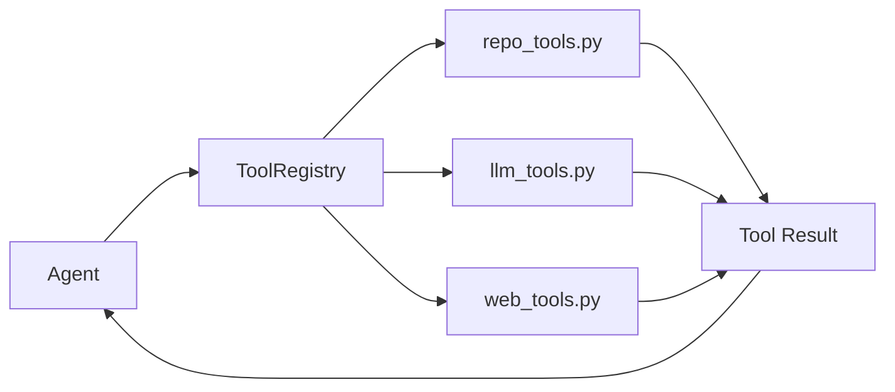

# Tools Ecosystem

The CodeFusion framework provides a comprehensive set of specialized tools for code exploration and analysis through the clean `cf/tools/` module.

## Tool Registry

The central tool management is handled by `cf/tools/registry.py`:

```python
from cf.tools.registry import ToolRegistry

# Initialize tool registry
registry = ToolRegistry("/path/to/repo")

# Get all available tool schemas for LLM function calling
schemas = registry.get_all_schemas()

# Execute a specific tool
result = registry.execute_tool("search_files", {
    "pattern": "FastAPI",
    "file_types": ["*.py"],
    "max_results": 10
})
```

## Available Tools

### Repository Tools (`cf/tools/repo_tools.py`)

**scan_directory**
- **Purpose**: Explore repository structure and find files
- **Usage**: LLM selects this for initial exploration
- **Parameters**: `directory`, `max_depth`, `file_types`

```python
from cf.tools.repo_tools import scan_directory

result = scan_directory({
    "directory": ".",
    "max_depth": 3,
    "file_types": [".py", ".js", ".md"]
})
```

**read_file**
- **Purpose**: Read and analyze file contents
- **Usage**: LLM selects this for detailed examination
- **Parameters**: `file_path`, `max_lines`

```python
from cf.tools.repo_tools import read_file

result = read_file({
    "file_path": "main.py",
    "max_lines": 100
})
```

**search_files**
- **Purpose**: Pattern-based file searching
- **Usage**: LLM selects this to find specific implementations
- **Parameters**: `pattern`, `file_types`, `max_results`

```python
from cf.tools.repo_tools import search_files

result = search_files({
    "pattern": "routing|router",
    "file_types": [".py"],
    "max_results": 20
})
```

### LLM Tools (`cf/tools/llm_tools.py`)

**analyze_code**
- **Purpose**: AI-powered code analysis and complexity assessment
- **Usage**: LLM selects this for deep code understanding
- **Parameters**: `code_content`, `analysis_type`

```python
from cf.tools.llm_tools import analyze_code

result = analyze_code({
    "code_content": "def hello():\n    return 'world'",
    "analysis_type": "complexity"
})
```

**llm_reasoning**
- **Purpose**: LLM-powered reasoning and decision making
- **Usage**: Agents use this for intelligent analysis
- **Parameters**: `context`, `question`, `reasoning_type`

```python
from cf.tools.llm_tools import llm_reasoning

result = llm_reasoning({
    "context": "Current codebase state",
    "question": "What should I analyze next?",
    "reasoning_type": "exploration_strategy"
})
```

### Web Tools (`cf/tools/web_tools.py`)

**web_search**
- **Purpose**: External knowledge search via DuckDuckGo API
- **Usage**: LLM selects this for external documentation
- **Parameters**: `query`, `max_results`, `search_type`

```python
from cf.tools.web_tools import web_search

result = web_search({
    "query": "FastAPI routing best practices",
    "max_results": 5,
    "search_type": "documentation"
})
```

## LLM Function Calling Integration

The tools are designed for LLM function calling where the AI selects optimal tools:

### Tool Schema Definition

Each tool provides an OpenAI-compatible schema:

```python
{
    "type": "function",
    "function": {
        "name": "search_files",
        "description": "Search for files matching a pattern",
        "parameters": {
            "type": "object",
            "properties": {
                "pattern": {
                    "type": "string",
                    "description": "Search pattern or keyword"
                },
                "file_types": {
                    "type": "array",
                    "items": {"type": "string"},
                    "description": "File extensions to search"
                }
            },
            "required": ["pattern"]
        }
    }
}
```

### LLM Tool Selection

Agents use LLM function calling to intelligently select tools:

```python
from cf.agents.code import CodeAgent

# CodeAgent uses LLM function calling internally
code_agent = CodeAgent("/path/to/repo", config)

# LLM will select appropriate tools based on the goal
result = code_agent.analyze("Find authentication implementation")

# Example LLM tool selection sequence:
# 1. scan_directory - Explore repository structure
# 2. search_files - Find auth-related files  
# 3. read_file - Examine key files
# 4. analyze_code - Understand implementation patterns
```

## Tool Execution Flow

### Agent → Registry → Tool Flow



### Error Handling

Tools include comprehensive error handling:

```python
try:
    result = registry.execute_tool("search_files", params)
    if result["success"]:
        data = result["result"]
    else:
        error = result["error"]
        print(f"Tool execution failed: {error}")
except Exception as e:
    print(f"Tool registry error: {e}")
```

## Tool Development

### Creating Custom Tools

To add new tools to the registry:

```python
# cf/tools/custom_tools.py
def analyze_dependencies(params, context):
    """Analyze project dependencies."""
    return {
        "dependencies": [],
        "analysis": "Dependency analysis complete"
    }

# Register in cf/tools/registry.py
class ToolRegistry:
    def __init__(self, repo_path):
        self.tools = {
            # Existing tools...
            "analyze_dependencies": analyze_dependencies
        }
```

### Tool Schema Requirements

Each tool must provide:
1. **Function implementation** with `params` and `context` parameters
2. **Schema definition** for LLM function calling
3. **Error handling** with try/catch blocks
4. **Result formatting** with consistent return structure

## Performance Characteristics

### Tool Execution Metrics

- **scan_directory**: ~1-3 seconds depending on repository size
- **read_file**: ~0.5-2 seconds depending on file size
- **search_files**: ~2-5 seconds depending on pattern complexity
- **analyze_code**: ~3-8 seconds depending on code complexity
- **web_search**: ~5-10 seconds depending on network and results

### Caching Integration

Tools leverage semantic caching for performance:

```python
from cf.cache.semantic import SemanticCache

# Tool results are automatically cached
cache = SemanticCache()
# Repeated tool calls with similar parameters use cached results
```

## Migration Guide

If migrating from the old tools system:

```python
# Old way (no longer available)
# from cf.tools.advanced_tools import scan_directory

# New way (clean architecture)
from cf.tools.repo_tools import scan_directory
from cf.tools.registry import ToolRegistry

# Use through registry for LLM function calling
registry = ToolRegistry("/path/to/repo")
result = registry.execute_tool("scan_directory", params)
```

For complete documentation, see the [main API index](index.md).