# Architecture

This document provides a comprehensive overview of CodeFusion's architecture, design patterns, and core components based on the actual codebase structure.

## High-Level Architecture

CodeFusion follows a **kernel-based design** with clear separation of concerns, as shown in the main architecture diagram from the [Workflow](workflow.md):

```mermaid
%%{init: {'theme':'base', 'themeVariables': {
    'primaryColor': '#ffffff',
    'primaryTextColor': '#1a1a1a',
    'primaryBorderColor': '#333333',
    'lineColor': '#2d3748',
    'secondaryColor': '#f7fafc',
    'tertiaryColor': '#edf2f7',
    'background': '#ffffff',
    'mainBkg': '#ffffff',
    'nodeBorder': '#2d3748',
    'clusterBkg': '#f8fafc',
    'clusterBorder': '#4a5568',
    'edgeLabelBackground': '#ffffff',
    'fontFamily': 'Arial, sans-serif',
    'fontSize': '16px',
    'nodeFontSize': '18px',
    'edgeLabelFontSize': '14px'
}}}%%

graph TB
    %% User Interfaces - Larger nodes with more padding
    CLI["<b>🖥️ CLI Interface</b><br/><br/>cf/run/run.py<br/>cf/__main__.py<br/><br/>Entry Point for<br/>User Commands"]
    WEB["<b>🌐 Web Interface</b><br/><br/>(Future Enhancement)<br/><br/>Browser-based<br/>Visual Exploration"]
    
    %% CodeFusion Agentic Kernel (Main Container)
    subgraph KERNEL ["<b>🧠 CodeFusion Agentic Kernel</b>"]
        direction TB
        
        %% Core Agentic Components Row
        subgraph CORE_ROW ["<b>Core Agentic Components</b>"]
            direction LR
            EXPLORATION["<b>🤖 Agentic Exploration</b><br/><br/>cf/agents/<br/><br/>• ReAct Strategy<br/>• Plan-then-Act<br/>• Sense-then-Act<br/><br/>Multi-strategy reasoning<br/>and code exploration"]
            INDEXING["<b>📑 Code Indexing</b><br/><br/>cf/indexer/<br/><br/>• File Processing<br/>• Entity Extraction<br/>• Batch Operations<br/><br/>Repository processing<br/>and analysis"]
        end
        
        %% Knowledge Graph System
        subgraph CKG ["<b>📊 Code Knowledge Graph - cf/kb/</b>"]
            direction LR
            VDB["<b>🔍 Vector Database</b><br/><br/>FAISS + Embeddings<br/>vector_kb.py<br/><br/>Semantic similarity<br/>search and retrieval"]
            ENTITIES["<b>📝 Code Entities</b><br/><br/>JSON Storage<br/>knowledge_base.py<br/><br/>Files, classes, functions<br/>with metadata"]
            RELATIONS["<b>🔗 Relationships</b><br/><br/>AST Analysis<br/>relationship_detector.py<br/><br/>Dependencies, calls,<br/>inheritance patterns"]
        end
        
        %% LLM and Analysis Row
        subgraph LLM_ROW ["<b>Language Model & Analysis</b>"]
            direction LR
            LLM["<b>🧠 LLM Proxy</b><br/><br/>cf/llm/llm_model.py<br/><br/>• Multi-Provider Support<br/>• LiteLLM Integration<br/><br/>OpenAI, Anthropic,<br/>local models"]
            ANALYZER["<b>🔬 Content Analyzer</b><br/><br/>cf/kb/content_analyzer.py<br/><br/>• Question Answering<br/>• Context Enrichment<br/><br/>Intelligent code<br/>understanding"]
        end
        
        %% Support Systems Row
        subgraph SUPPORT_ROW ["<b>Support Systems</b>"]
            direction LR
            CONFIG["<b>⚙️ Configuration</b><br/><br/>cf/config.py<br/><br/>• YAML/JSON Support<br/>• Environment Override<br/><br/>System configuration<br/>management"]
            TYPES["<b>📋 Type System</b><br/><br/>cf/types.py<br/><br/>• Entity Types<br/>• Relationship Types<br/><br/>Comprehensive type<br/>definitions"]
            EXCEPTIONS["<b>⚠️ Exception Handling</b><br/><br/>cf/exceptions.py<br/><br/>• Error Hierarchy<br/>• Graceful Recovery<br/><br/>Robust error<br/>management"]
        end
        
        %% Internal Kernel Connections with proper spacing
        EXPLORATION -.->|"<b>queries</b>"| CKG
        INDEXING -.->|"<b>populates</b>"| CKG
        EXPLORATION -.->|"<b>reasoning</b>"| LLM
        LLM -.->|"<b>responses</b>"| ANALYZER
        ANALYZER -.->|"<b>enriched context</b>"| CKG
        CONFIG -.->|"<b>configures</b>"| EXPLORATION
        CONFIG -.->|"<b>configures</b>"| LLM
        ENTITIES -.->|"<b>linked to</b>"| RELATIONS
        VDB -.->|"<b>semantic search</b>"| ENTITIES
    end
    
    %% Agent Computer Interface
    subgraph ACI ["<b>🔌 Agent Computer Interface - cf/aci/</b>"]
        direction TB
        
        subgraph ACI_TOP ["<b>Repository & Environment Management</b>"]
            direction LR
            REPO["<b>📁 Repository Access</b><br/><br/>repo.py<br/><br/>• LocalCodeRepo<br/>• RemoteCodeRepo<br/><br/>File system abstraction<br/>and repository handling"]
            ENVMGR["<b>🌍 Environment Manager</b><br/><br/>environment_manager.py<br/><br/>• System State<br/>• Resource Management<br/><br/>Environment context<br/>and search capabilities"]
        end
        
        subgraph ACI_BOTTOM ["<b>System Access & Analysis</b>"]
            direction LR
            SYSACCESS["<b>🖥️ System Access</b><br/><br/>system_access.py<br/><br/>• Environment Variables<br/>• Command Execution<br/><br/>System interface<br/>and control"]
            CODEINSP["<b>🔬 Code Inspector</b><br/><br/>code_inspector.py<br/><br/>• AST Analysis<br/>• Pattern Detection<br/><br/>Code structure<br/>analysis"]
        end
    end
    
    %% External Sources
    subgraph EXTERNAL ["<b>🌐 External Sources</b>"]
        direction LR
        GITHUB["<b>📦 GitHub</b><br/><br/>Remote Repositories<br/><br/>Git-based repository<br/>access and cloning"]
        REMOTE["<b>☁️ Cloud Storage</b><br/><br/>Remote Archives<br/><br/>Cloud-based repository<br/>and file access"] 
        LOCAL["<b>💽 Local Filesystem</b><br/><br/>Directory Access<br/><br/>Local file and<br/>directory operations"]
    end
    
    %% Main Flow Connections with better arrow paths
    CLI ==>|"<b>user commands</b>"| KERNEL
    WEB -.->|"<b>future web UI</b>"| KERNEL
    
    KERNEL <==>|"<b>system interface</b>"| ACI
    
    %% ACI to External connections
    REPO ==>|"<b>clone/fetch</b>"| GITHUB
    REPO ==>|"<b>download</b>"| REMOTE
    REPO ==>|"<b>read files</b>"| LOCAL
    
    %% Detailed Internal Flows with cleaner paths
    REPO ==>|"<b>file content</b>"| INDEXING
    ENVMGR ==>|"<b>context</b>"| EXPLORATION
    CODEINSP ==>|"<b>analysis</b>"| CKG
    SYSACCESS ==>|"<b>env vars</b>"| CONFIG
    
    %% High Contrast Professional Color Styling
    classDef userInterface fill:#1e40af,stroke:#1e3a8a,stroke-width:3px,color:#ffffff
    classDef kernel fill:#7c3aed,stroke:#6d28d9,stroke-width:4px,color:#ffffff
    classDef coreComponent fill:#dc2626,stroke:#b91c1c,stroke-width:3px,color:#ffffff
    classDef knowledge fill:#059669,stroke:#047857,stroke-width:3px,color:#ffffff
    classDef external fill:#d97706,stroke:#b45309,stroke-width:3px,color:#ffffff
    classDef aci fill:#0284c7,stroke:#0369a1,stroke-width:3px,color:#ffffff
    classDef support fill:#4338ca,stroke:#3730a3,stroke-width:3px,color:#ffffff
    classDef invisible fill:transparent,stroke:transparent
    
    class CLI,WEB userInterface
    class KERNEL kernel
    class EXPLORATION,INDEXING,LLM,ANALYZER coreComponent
    class CKG,VDB,ENTITIES,RELATIONS knowledge
    class GITHUB,REMOTE,LOCAL external
    class ACI,REPO,SYSACCESS,ENVMGR,CODEINSP aci
    class CONFIG,TYPES,EXCEPTIONS support
    class CORE_ROW,LLM_ROW,SUPPORT_ROW,ACI_TOP,ACI_BOTTOM,EXTERNAL invisible
```



## Core Components

Based on the actual codebase structure, CodeFusion is organized into the following main components:

### 1. CLI Interface (`cf/run/` and `cf/__main__.py`)

The command-line interface provides user interaction and orchestrates the entire system.

**Key Files:**
- `cf/__main__.py`: CLI entry point for `python -m cf`
- `cf/run/run.py`: Main CLI implementation with command routing
- `cf/run/explore_single_repo.py`: Single repository exploration
- `cf/run/explore_batch_repo.py`: Batch repository processing
- `cf/run/setup_neo4j.py`: Neo4j setup utilities

**CLI Commands:**
- `cf index <repo_path>`: Index a repository
- `cf query "<question>"`: Query the knowledge base
- `cf explore <repo_path>`: Full exploration workflow
- `cf stats`: Show knowledge base statistics
- `cf demo <repo_path>`: Run demonstration

### 2. Agent Computer Interface (`cf/aci/`)

The ACI layer provides the interface between agents and computer systems.

**Key Components:**
- `cf/aci/repo.py`: Repository abstractions (LocalCodeRepo, RemoteCodeRepo)
- `cf/aci/environment_manager.py`: Environment and system management
- `cf/aci/system_access.py`: System access utilities and environment variables
- `cf/aci/code_inspector.py`: Code analysis and inspection tools
- `cf/aci/computer_interface.py`: System interface layer

**Responsibilities:**
- Repository access and abstraction
- Environment variable management
- System command execution
- File system operations
- Code structure analysis

### 3. Agentic Exploration (`cf/agents/`)

Multi-strategy code exploration using different reasoning approaches.

**Exploration Strategies:**
- `cf/agents/reasoning_agent.py`: **ReAct** (Reasoning + Acting) strategy
- `cf/agents/plan_then_act.py`: **Plan-then-Act** systematic strategy
- `cf/agents/sense_then_act.py`: **Sense-then-Act** adaptive strategy

**Strategy Features:**
- ReAct: Fast, iterative exploration with reasoning loops
- Plan-Act: Systematic planning followed by execution
- Sense-Act: Environmental sensing with adaptive responses

### 4. Knowledge Base (`cf/kb/`)

Pluggable storage backends for code knowledge and relationships.

**Key Components:**
- `cf/kb/knowledge_base.py`: Core knowledge base implementation
- `cf/kb/vector_kb.py`: Vector database backend using FAISS
- `cf/kb/content_analyzer.py`: Content analysis and question answering
- `cf/kb/relationship_detector.py`: Code relationship detection

**Storage Types:**
- **Vector Database**: FAISS-based semantic similarity search
- **Neo4j Graph**: Graph database for complex relationships (optional)
- **Text Storage**: Simple JSON-based storage for entities/relationships

**Knowledge Representation:**
- **Entities**: Files, classes, functions, variables with metadata
- **Relationships**: Import dependencies, function calls, inheritance
- **Embeddings**: Semantic vectors for similarity search

### 5. LLM Integration (`cf/llm/`)

Abstraction layer for language model providers.

**Key Components:**
- `cf/llm/llm_model.py`: LLM abstraction layer

**Features:**
- Multi-provider support via LiteLLM
- OpenAI, Anthropic, Cohere, local models
- Token usage tracking
- Response caching
- Rate limiting and retry logic

### 6. Code Indexing (`cf/indexer/`)

Repository processing and analysis.

**Key Components:**
- `cf/indexer/code_indexer.py`: Main repository indexing orchestrator

**Capabilities:**
- File system traversal with filtering
- Code entity extraction
- Relationship detection
- Batch processing
- Progress tracking

## Core Supporting Components

### 7. Configuration Management (`cf/config.py`)

Centralized configuration system supporting multiple formats and sources.

**Key Features:**
- YAML and JSON configuration file support
- Environment variable override capability
- Configuration validation and type checking
- Hierarchical configuration loading

### 8. Type System (`cf/types.py`)

Comprehensive type definitions for the entire system.

**Key Type Definitions:**
- `EntityType`: File, class, function, variable, import, comment types
- `RelationshipType`: Import, call, inherit, use, contain relationships
- `LanguageType`: Python, JavaScript, TypeScript, Java, etc.
- `ExplorationStrategy`: react, plan_act, sense_act strategies
- `KnowledgeBaseType`: text, vector, neo4j storage types

### 9. Exception Handling (`cf/exceptions.py`)

Custom exception hierarchy for robust error management.

**Exception Categories:**
- Configuration errors
- Repository access errors
- Knowledge base operation errors
- LLM provider errors
- System access errors

## Design Principles

### 1. Kernel-Based Architecture

CodeFusion follows a **kernel-based design** where all core functionality is contained within the "CodeFusion Agentic Kernel" that coordinates:

- **Agentic exploration** strategies
- **Knowledge base** management
- **LLM integration** with multiple providers
- **Configuration** and **type management**

### 2. Agent Computer Interface (ACI)

The ACI provides a clean abstraction layer between AI agents and computer systems:

- **Repository abstraction**: Local and remote repository access
- **System interface**: Environment variables, file operations
- **Code inspection**: AST-based analysis and pattern detection
- **Environment management**: Search capabilities and resource management

### 3. Multi-Strategy Exploration

Three distinct exploration strategies for different use cases:

- **ReAct**: Fast iterative reasoning and acting for general exploration
- **Plan-then-Act**: Systematic planning for thorough analysis
- **Sense-then-Act**: Adaptive sensing for complex codebases

### 4. Pluggable Storage Backends

Support for multiple knowledge base types:

- **Vector Database**: FAISS-based semantic similarity search
- **Neo4j Graph**: Complex relationship analysis (optional)
- **Text Storage**: Simple JSON-based storage for minimal dependencies

### 5. Configuration-Driven Behavior

All system behavior controlled through YAML configuration:

```yaml
# Example: Complete configuration
llm_model: "gpt-4o"
kb_type: "vector"
exploration_strategy: "react"
max_exploration_depth: 5
embedding_model: "all-MiniLM-L6-v2"
```

## Data Flow and Workflows

CodeFusion follows two main workflow patterns as detailed in the [Workflow Diagrams](workflow.md):

### 1. Repository Exploration and Indexing Workflow

The indexing workflow involves systematic repository processing:

1. **Configuration Loading**: System loads user settings and preferences from `config/default/config.yaml`
2. **Repository Access**: `cf/aci/repo.py` scans and analyzes repository structure
3. **Knowledge Base Setup**: `cf/kb/knowledge_base.py` initializes storage layer (Neo4j or Vector DB)
4. **Content Analysis**: `cf/indexer/code_indexer.py` extracts code entities and relationships
5. **Persistent Storage**: Saves structured knowledge in JSON files and FAISS indexes

**Key Files Involved:**
- `cf/run/run.py`: CLI command orchestration
- `cf/aci/repo.py`: Repository abstraction and file access
- `cf/indexer/code_indexer.py`: Main indexing logic
- `cf/kb/knowledge_base.py`: Storage coordination
- `cf/kb/vector_kb.py`: Vector database operations

### 2. Query Processing Workflow

The query workflow handles natural language questions:

1. **Query Analysis**: `cf/agents/` strategies process natural language questions
2. **Multi-Strategy Search**: Uses vector similarity (`cf/kb/vector_kb.py`) and relationship traversal
3. **Context Enrichment**: `cf/kb/content_analyzer.py` gathers related entities and relationships
4. **LLM Integration**: `cf/llm/llm_model.py` generates comprehensive answers with context
5. **Response Delivery**: Returns structured answers with supporting evidence

**Key Files Involved:**
- `cf/run/run.py`: Query command handling
- `cf/agents/reasoning_agent.py`: ReAct strategy implementation
- `cf/kb/content_analyzer.py`: Question answering logic
- `cf/llm/llm_model.py`: LLM provider abstraction
- `cf/kb/relationship_detector.py`: Context enrichment

## Component Details

### CLI Layer (`cf/run/` and `cf/__main__.py`)

The CLI layer uses a modular command architecture:

**Main Entry Points:**
- `cf/__main__.py`: Primary CLI entry point for `python -m cf`
- `cf/run/run.py`: Main command implementation and routing
- `cf/run/explore_single_repo.py`: Single repository exploration workflow
- `cf/run/explore_batch_repo.py`: Batch processing for multiple repositories

**Command Structure:**
```python
# From cf/run/run.py
def main():
    """Main CLI entry point with command routing"""
    parser = create_argument_parser()
    args = parser.parse_args()
    
    # Route to appropriate command handler
    if args.command == "index":
        return handle_index_command(args)
    elif args.command == "query":
        return handle_query_command(args)
    # ... other commands
```

**Key Features:**
- Argument parsing with `argparse`
- Configuration loading from YAML files
- Progress reporting and user feedback
- Error handling and graceful failures

### ACI Layer (`cf/aci/`)

The Agent Computer Interface provides system abstraction:

**Repository Abstraction (`cf/aci/repo.py`):**
```python
class LocalCodeRepo:
    """Local repository access and file operations"""
    def get_file_content(self, file_path: str) -> str
    def list_files(self, pattern: str = None) -> List[str]
    def get_repository_structure(self) -> Dict
```

**Environment Management (`cf/aci/environment_manager.py`):**
- System environment access
- Search capabilities
- Resource management
- Repository overview generation

**System Access (`cf/aci/system_access.py`):**
- Environment variable management
- Command execution
- File system operations

### Knowledge Base Layer (`cf/kb/`)

**Core Implementation (`cf/kb/knowledge_base.py`):**
The main knowledge base provides unified access to different storage backends:

```python
class CodeKnowledgeBase:
    """Main knowledge base coordinator"""
    def __init__(self, kb_type: str, config: Config)
    def store_entities(self, entities: List[Entity]) -> None
    def query_entities(self, query: str) -> List[Entity]
    def get_relationships(self, entity_id: str) -> List[Relationship]
```

**Vector Storage (`cf/kb/vector_kb.py`):**
- FAISS-based vector database
- Sentence-transformers for embeddings
- Semantic similarity search
- Fast content discovery

**Content Analysis (`cf/kb/content_analyzer.py`):**
- Intelligent question answering
- Context-aware responses
- Entity relationship analysis

**Relationship Detection (`cf/kb/relationship_detector.py`):**
- AST-based code analysis
- Import dependency tracking
- Function call graph construction
- Class inheritance detection

### LLM Integration Layer (`cf/llm/`)

**Provider Abstraction (`cf/llm/llm_model.py`):**
```python
class LlmModel:
    """LLM provider abstraction using LiteLLM"""
    def __init__(self, model: str, config: Config)
    def generate_response(self, prompt: str, **kwargs) -> str
    def get_embeddings(self, text: str) -> List[float]
```

**Features:**
- Multi-provider support via LiteLLM
- OpenAI, Anthropic, Cohere integration
- Token usage tracking
- Response caching
- Rate limiting and error handling

### Agentic Exploration (`cf/agents/`)

**ReAct Strategy (`cf/agents/reasoning_agent.py`):**
- Reasoning + Acting cycles
- Fast iterative exploration
- Context-aware decision making

**Plan-then-Act (`cf/agents/plan_then_act.py`):**
- Strategic planning phase
- Systematic execution
- Goal-oriented exploration

**Sense-then-Act (`cf/agents/sense_then_act.py`):**
- Environmental observation
- Adaptive strategy adjustment
- Complex codebase handling

## Configuration Architecture

### Configuration System (`cf/config.py`)

CodeFusion uses a centralized configuration system that supports:

**Configuration Sources (in order of precedence):**
1. Command-line arguments (highest priority)
2. Configuration files (YAML/JSON)
3. Environment variables
4. Default values (lowest priority)

**Key Features:**
- YAML and JSON file support
- Environment variable override capability
- Type validation and checking
- Default configuration in `config/default/config.yaml`

**Configuration Loading:**
```python
# From cf/config.py
class CfConfig:
    """Main configuration class"""
    @classmethod
    def from_file(cls, config_path: str) -> 'CfConfig'
    @classmethod
    def from_dict(cls, config_dict: Dict) -> 'CfConfig'
    
    def validate(self) -> None
    def to_dict(self) -> Dict
```

## Error Handling (`cf/exceptions.py`)

CodeFusion implements a comprehensive exception hierarchy for robust error management:

### Exception Categories

**Custom Exception Types:**
- **Configuration Errors**: Invalid settings, missing required fields
- **Repository Access Errors**: File system issues, permission problems
- **Knowledge Base Errors**: Storage operation failures
- **LLM Provider Errors**: API failures, rate limits, authentication issues
- **System Access Errors**: Environment variable or command execution issues

### Error Recovery Strategies

**Graceful Degradation:**
- Neo4j fallback to vector storage
- LLM provider failover
- Partial indexing continuation
- Configuration validation with helpful messages

**User-Friendly Error Messages:**
- Clear error descriptions
- Suggested fixes and solutions
- Configuration validation feedback
- Progress preservation during failures

## Performance Considerations

### Batch Processing

CodeFusion implements efficient batch processing for large repositories:

**File Processing:**
- Configurable batch sizes for memory management
- Parallel processing with worker threads
- Progress tracking and user feedback
- Incremental processing with checkpoints

**Vector Operations:**
- FAISS-based similarity search for fast queries
- Optimized embedding generation
- Cached embeddings to avoid recomputation
- Memory-efficient vector storage

### Caching Strategy

**Knowledge Base Caching:**
- Entity and relationship caching
- Embedding cache for repeated content
- LLM response caching for similar queries
- Artifact reuse across sessions

**File System Optimization:**
- Timestamped artifact directories (`artifacts_{repo_name}_{timestamp}/`)
- Incremental indexing for modified files
- Configuration-based file filtering
- Efficient repository traversal

### Memory Management

**Storage Optimization:**
- Configurable maximum file sizes
- Aggressive directory exclusion (node_modules, .git, etc.)
- Streaming file processing
- Garbage collection for large repositories

**Resource Monitoring:**
- Memory usage tracking
- Configurable worker limits
- Automatic cleanup mechanisms
- Performance metrics collection

## Testing Architecture (`tests/`)

### Current Test Structure

Based on the actual test directory:

```
tests/
├── __init__.py
├── test_config.py              # Configuration testing
├── test_knowledge_base.py      # Knowledge base functionality
├── test_neo4j.py              # Neo4j backend testing
└── test_kb/                   # Additional KB-specific tests
```

### Test Framework

**Testing Tools:**
- **pytest**: Main testing framework
- **pytest-cov**: Coverage reporting
- **pytest-mock**: Mocking and fixtures
- **Pre-commit hooks**: Code quality enforcement

**Test Categories:**
- **Unit Tests**: Individual component testing
- **Integration Tests**: Knowledge base and LLM integration
- **Configuration Tests**: YAML parsing and validation
- **Backend Tests**: Vector and Neo4j storage testing

## Extension Points

CodeFusion's modular architecture supports several extension points:

### Custom Knowledge Base Backends

Extend `cf/kb/knowledge_base.py` to add new storage backends:
- Implement vector database alternatives (Pinecone, Weaviate)
- Add graph database options (ArangoDB, Amazon Neptune)
- Create cloud-based storage integrations

### Custom Exploration Strategies

Add new reasoning strategies in `cf/agents/`:
- Implement domain-specific exploration patterns
- Create hybrid strategies combining existing approaches
- Add specialized strategies for different programming languages

### Custom LLM Providers

Extend `cf/llm/llm_model.py` for new LLM integrations:
- Local model deployments
- Enterprise LLM services
- Specialized code-understanding models

### Repository Adapters

Extend `cf/aci/repo.py` for different repository types:
- Git repository analysis
- Cloud repository access (GitHub, GitLab)
- Archive and snapshot processing

## Directory Structure Summary

Based on the repository scan, here's the complete CodeFusion structure:

```
codefusion/
├── cf/                           # Main package
│   ├── __init__.py              # Package exports (version 0.0.1)
│   ├── __main__.py              # CLI entry point
│   ├── config.py                # Configuration management
│   ├── types.py                 # Type definitions and enums
│   ├── exceptions.py            # Exception hierarchy
│   ├── aci/                     # Agent Computer Interface
│   │   ├── repo.py              # Repository abstractions
│   │   ├── environment_manager.py
│   │   ├── system_access.py
│   │   ├── code_inspector.py
│   │   └── computer_interface.py
│   ├── agents/                  # Exploration strategies
│   │   ├── reasoning_agent.py   # ReAct strategy
│   │   ├── plan_then_act.py     # Plan-then-Act
│   │   └── sense_then_act.py    # Sense-then-Act
│   ├── indexer/                 # Code indexing
│   │   └── code_indexer.py
│   ├── kb/                      # Knowledge base
│   │   ├── knowledge_base.py    # Core KB implementation
│   │   ├── vector_kb.py         # FAISS backend
│   │   ├── content_analyzer.py  # Q&A system
│   │   └── relationship_detector.py
│   ├── llm/                     # LLM integration
│   │   └── llm_model.py         # Provider abstraction
│   └── run/                     # CLI implementations
│       ├── run.py               # Main CLI
│       ├── explore_single_repo.py
│       ├── explore_batch_repo.py
│       └── setup_neo4j.py
├── config/default/              # Configuration
│   └── config.yaml             # Default settings
├── docs/                       # Documentation
├── tests/                      # Test suite
├── kb/                         # Knowledge base storage
├── trace/                      # LLM tracing
├── artifacts_*/                # Timestamped analysis results
├── pyproject.toml              # Python project config
├── mkdocs.yml                  # Documentation config
└── README.md                   # Project overview
```

## Key Architectural Insights

1. **Kernel-based Design**: Central "CodeFusion Agentic Kernel" coordinates all operations
2. **ACI Layer**: Clean abstraction between agents and computer systems
3. **Multi-strategy Exploration**: ReAct, Plan-then-Act, Sense-then-Act approaches
4. **Pluggable Storage**: Vector (FAISS), Neo4j, and text-based backends
5. **LLM Abstraction**: Multi-provider support via LiteLLM
6. **Configuration-driven**: YAML-based configuration with environment override
7. **Artifact Management**: Timestamped directories for analysis persistence

## Next Steps

- Review the [development setup](contributing.md) guide
- Explore [testing strategies](testing.md)
- Check the [API reference](../reference/api.md) for implementation details
