# CodeFusion ReAct Architecture

CodeFusion is built on a comprehensive ReAct (Reasoning + Acting) framework that enables intelligent, agent-based code exploration through systematic reasoning, tool usage, and observation.

## Design Philosophy

### Core Principles

1. **ReAct Pattern**: Systematic Reason → Act → Observe loops for intelligent exploration
2. **Multi-Agent Architecture**: Specialized agents for different aspects of code analysis
3. **Tool-Rich Ecosystem**: Comprehensive tool set for repository exploration
4. **LLM Integration**: Advanced reasoning and summarization through multiple LLM providers
5. **Persistent Memory**: Caching and tracing across sessions for continuity

### Key Features

- ✅ **ReAct Loop Framework**: Proper reasoning-action-observation cycles
- ✅ **Multi-Agent System**: Specialized agents for documentation, codebase, architecture, and supervision
- ✅ **Advanced Caching**: Persistent cross-session caching with TTL and LRU eviction
- ✅ **LLM Integration**: OpenAI, Anthropic, and LLaMA support via LiteLLM
- ✅ **Comprehensive Tracing**: Performance monitoring and debugging capabilities
- ✅ **Error Recovery**: Robust error handling with circuit breakers and recovery strategies
- ✅ **Tool Validation**: Parameter and result validation with retry mechanisms

## ReAct Architecture Overview


## ReAct Framework Components

### 1. ReAct Base Agent (`cf/core/react_agent.py`)

**Core ReAct implementation** providing the foundation for all specialized agents.

**Key Features**:
- **ReAct Loop**: Complete Reason → Act → Observe cycle implementation
- **Tool Ecosystem**: 8 different action types with comprehensive tooling
- **Error Handling**: Circuit breakers, retry logic, and recovery strategies
- **Caching**: Persistent caching with TTL and LRU eviction
- **Validation**: Parameter and result validation for all tools
- **Tracing**: Comprehensive execution tracing and performance monitoring

**Abstract Methods** (implemented by specialized agents):
```python
def reason(self) -> str: 
    """Reasoning phase: Think about what to do next"""

def plan_action(self, reasoning: str) -> ReActAction:
    """Plan the next action based on reasoning"""

def _generate_summary(self) -> str:
    """Generate a summary of the agent's work"""
```

**Available Tools**:
- `SCAN_DIRECTORY` - Recursive directory exploration
- `LIST_FILES` - File listing with pattern matching
- `READ_FILE` - File content reading with limits
- `SEARCH_FILES` - Pattern searching across files
- `ANALYZE_CODE` - Code structure analysis
- `LLM_REASONING` - AI-powered reasoning
- `LLM_SUMMARY` - AI-powered summarization
- `CACHE_LOOKUP/STORE` - Cache operations

### 2. Specialized ReAct Agents

#### Documentation Agent (`cf/agents/react_documentation_agent.py`)
- **Purpose**: Analyze README files, documentation, and guides
- **Specialization**: Markdown parsing, documentation structure analysis
- **Tools**: Focus on document discovery and content analysis

#### Codebase Agent (`cf/agents/react_codebase_agent.py`)
- **Purpose**: Analyze source code, classes, functions, and patterns
- **Specialization**: Code entity extraction, complexity analysis, dependency mapping
- **Tools**: Language-specific parsing and code pattern detection

#### Architecture Agent (`cf/agents/react_architecture_agent.py`)
- **Purpose**: Understand system design, components, and architectural patterns
- **Specialization**: Component identification, pattern detection, design analysis
- **Tools**: System-level analysis and architectural insight generation

#### Supervisor Agent (`cf/agents/react_supervisor_agent.py`)
- **Purpose**: Orchestrate multiple agents and synthesize insights
- **Specialization**: Multi-agent coordination and cross-agent insight synthesis
- **Tools**: Agent management and result aggregation

### 3. LLM Integration (`cf/llm/`)

**Real LLM Interface** (`cf/llm/real_llm.py`):
- **LiteLLM Integration**: Unified interface for multiple providers
- **Supported Providers**:
  - **OpenAI**: GPT-3.5-turbo, GPT-4
  - **Anthropic**: Claude 3 Sonnet, Claude 3 Opus
  - **LLaMA**: Via Together AI, Replicate, Ollama
- **Response Parsing**: Robust JSON and text parsing with fallbacks
- **Error Handling**: Graceful degradation to Simple LLM

**Configuration Options**:
```bash
# OpenAI
CF_LLM_MODEL=gpt-4
CF_LLM_API_KEY=your-openai-key

# Anthropic
CF_LLM_MODEL=claude-3-sonnet-20240229
CF_LLM_API_KEY=your-anthropic-key

# LLaMA via Together AI
CF_LLM_MODEL=together_ai/meta-llama/Llama-2-7b-chat-hf
CF_LLM_API_KEY=your-together-ai-key
```

### 4. Configuration System (`cf/core/react_config.py`)

**Comprehensive Configuration** with environment variable support:

```python
@dataclass
class ReActConfig:
    # Loop parameters
    max_iterations: int = 20
    iteration_timeout: float = 30.0
    total_timeout: float = 600.0
    
    # Error handling
    max_errors: int = 10
    max_consecutive_errors: int = 3
    error_recovery_enabled: bool = True
    
    # Caching
    cache_enabled: bool = True
    cache_max_size: int = 1000
    cache_ttl: int = 3600
    
    # Tracing and logging
    tracing_enabled: bool = True
    trace_directory: Optional[str] = None
```

**Performance Profiles**:
- **Fast**: Quick exploration (10 iterations, 15s timeout)
- **Balanced**: Default recommended (20 iterations, 30s timeout)
- **Thorough**: Comprehensive analysis (50 iterations, 60s timeout)

### 5. Tracing System (`cf/core/react_tracing.py`)

**Comprehensive Execution Monitoring**:

```python
@dataclass
class ReActTrace:
    trace_id: str
    agent_name: str
    iteration: int
    phase: str  # 'reason', 'act', 'observe'
    timestamp: float
    duration: float
    content: Dict[str, Any]
    success: bool
    error: Optional[str]
```

**Features**:
- **Session Management**: Start/end session tracking
- **Phase Tracing**: Individual reason/act/observe phase monitoring
- **Performance Metrics**: Duration, success rates, error tracking
- **Persistent Storage**: JSON export for post-analysis
- **Global Metrics**: Aggregated statistics across all sessions

### 6. Advanced Caching (`cf/core/react_agent.py` - ReActCache)

**Persistent Cross-Session Caching**:

```python
class ReActCache:
    def __init__(self, max_size: int = 1000, cache_dir: Optional[str] = None, ttl: int = 3600):
        # In-memory cache with disk persistence
        # TTL-based expiration
        # LRU eviction policy
```

**Features**:
- **Persistent Storage**: JSON files for cross-session continuity
- **TTL Expiration**: Automatic cleanup of stale entries
- **LRU Eviction**: Memory-efficient cache size management
- **Error Resilience**: Graceful handling of corrupt cache files

## ReAct Loop Flow

```mermaid
sequenceDiagram
    participant User
    participant CLI
    participant Supervisor
    participant Agent
    participant Tools
    participant LLM
    participant Cache
    participant Tracer

    User->>CLI: cf analyze /repo --focus=all
    CLI->>Supervisor: explore_repository(focus="all")
    
    Supervisor->>Tracer: start_session("supervisor", goal)
    
    loop ReAct Loop (max_iterations)
        Note over Supervisor: 🧠 REASON Phase
        Supervisor->>Supervisor: reason() - analyze current state
        Supervisor->>Tracer: trace_phase("reason", reasoning)
        
        Note over Supervisor: 🎯 ACT Phase  
        Supervisor->>Supervisor: plan_action(reasoning)
        Supervisor->>Agent: activate_agent(agent_type)
        
        Agent->>Tracer: start_session("agent", sub_goal)
        
        loop Agent ReAct Loop
            Agent->>Agent: reason() - determine next tool
            Agent->>Tools: execute_tool(action_params)
            Tools->>Cache: check_cache(cache_key)
            alt Cache Miss
                Tools->>LLM: llm_reasoning/summarize(content)
                LLM-->>Tools: ai_response
                Tools->>Cache: store_result(cache_key, result)
            end
            Cache-->>Tools: cached_result
            Tools-->>Agent: tool_result
            Agent->>Agent: observe(tool_result)
            Agent->>Tracer: trace_phase("act", action_result)
        end
        
        Agent->>Tracer: end_session(agent_results)
        Agent-->>Supervisor: agent_insights
        
        Note over Supervisor: 👁️ OBSERVE Phase
        Supervisor->>Supervisor: observe(agent_insights)
        Supervisor->>Tracer: trace_phase("observe", observations)
        
        Supervisor->>Supervisor: check_goal_achieved()
    end
    
    Supervisor->>Supervisor: synthesize_cross_agent_insights()
    Supervisor->>Tracer: end_session(final_results)
    Supervisor-->>CLI: comprehensive_analysis
    CLI-->>User: formatted_results + metrics
```



## Tool Validation & Error Recovery

### Parameter Validation
```python
def _validate_action_parameters(self, action: ReActAction) -> Optional[str]:
    """Validate action parameters before execution"""
    if action.action_type == ActionType.READ_FILE:
        if 'file_path' not in action.parameters:
            return "file_path parameter required for READ_FILE"
    # ... additional validations
```

### Result Validation
```python
def _validate_tool_result(self, action: ReActAction, result: Any) -> Dict[str, Any]:
    """Validate tool execution result"""
    if isinstance(result, dict) and 'error' in result:
        return {'valid': False, 'error': f"Tool returned error: {result['error']}"}
    # ... additional validations
```

### Error Recovery Strategies
```python
def _attempt_tool_recovery(self, action: ReActAction, error: str) -> Optional[str]:
    """Attempt to recover from tool execution error"""
    error_lower = error.lower()
    
    if 'file not found' in error_lower:
        return 'file_not_found'  # Switch to directory scan
    elif 'permission denied' in error_lower:
        return 'permission_denied'  # Try different approach
    elif 'timeout' in error_lower:
        return 'timeout'  # Use cached results
```

## Performance Characteristics

### Time Complexity
- **ReAct Loop**: O(n × m) where n = iterations, m = tools per iteration
- **Caching**: O(1) lookup and storage with O(log k) eviction
- **Tool Execution**: O(f) where f = file/directory size being processed

### Space Complexity
- **Memory**: O(c + t + s) where c = cache size, t = trace data, s = session state
- **Storage**: Persistent cache and trace files scale with usage

### Scalability Features
- **Configurable Limits**: Max iterations, timeouts, cache sizes
- **Circuit Breakers**: Prevent infinite loops and cascading failures
- **Resource Management**: TTL expiration, LRU eviction, timeout handling
- **Parallel Potential**: Framework supports future parallel tool execution

## Configuration Examples

### Environment Variables
```bash
# Basic Configuration
CF_REACT_MAX_ITERATIONS=20
CF_REACT_ITERATION_TIMEOUT=30.0
CF_REACT_TOTAL_TIMEOUT=600.0

# Caching
CF_REACT_CACHE_ENABLED=true
CF_REACT_CACHE_MAX_SIZE=1000
CF_REACT_CACHE_TTL=3600

# Tracing
CF_REACT_TRACING_ENABLED=true
CF_REACT_TRACE_DIR=./traces

# LLM Integration
CF_LLM_MODEL=gpt-4
CF_LLM_API_KEY=your-api-key
CF_LLM_MAX_TOKENS=1000
CF_LLM_TEMPERATURE=0.7
```

### Performance Profiles
```python
# Fast Profile - Quick Analysis
config = ReActConfig()
config.apply_performance_profile("fast")
# max_iterations=10, timeouts=15s, cache=500

# Balanced Profile - Default
config.apply_performance_profile("balanced") 
# max_iterations=20, timeouts=30s, cache=1000

# Thorough Profile - Comprehensive Analysis
config.apply_performance_profile("thorough")
# max_iterations=50, timeouts=60s, cache=2000
```

## Usage Examples

### Basic Repository Analysis
```bash
# Multi-agent comprehensive analysis
cf analyze /path/to/repo --focus=all

# Documentation-focused analysis  
cf analyze /path/to/repo --focus=docs

# Architecture-focused analysis
cf analyze /path/to/repo --focus=arch
```

### Configuration-Driven Analysis
```bash
# Fast analysis for quick insights
CF_REACT_MAX_ITERATIONS=10 cf analyze /repo

# Thorough analysis with tracing
CF_REACT_TRACING_ENABLED=true CF_REACT_TRACE_DIR=./traces cf analyze /repo

# LLaMA-powered analysis
CF_LLM_MODEL=together_ai/meta-llama/Llama-2-7b-chat-hf cf analyze /repo
```

## Future Architecture Enhancements

### Planned Features
1. **Parallel Tool Execution**: Execute multiple tools concurrently
2. **Dynamic Agent Loading**: Plugin-based agent architecture
3. **Interactive Mode**: Real-time user feedback integration
4. **Advanced Caching**: Semantic similarity-based cache keys
5. **Distributed Tracing**: Multi-node execution monitoring

### Extensibility Points
1. **Custom Agents**: Implement ReActAgent for domain-specific analysis
2. **Custom Tools**: Add ActionType and tool implementations
3. **Custom LLM Providers**: Extend LiteLLM integration
4. **Custom Trace Formats**: Alternative trace storage and analysis

---

*This architecture provides a robust, scalable foundation for intelligent code exploration through the proven ReAct pattern, comprehensive tooling, and multi-agent coordination.*