# CodeFusion Interactive Architecture

CodeFusion is an **interactive, multi-agent LLM-powered system** for intelligent codebase exploration and analysis. The architecture enables continuous question-answer sessions with persistent memory, adaptive response formats, and seamless web search integration. **The primary innovation is the intelligent response format detection and multi-agent coordination that provides the right type of analysis for each question.**

## Design Philosophy

### Core Principles

1. **Interactive Sessions**: Continuous question-answer with persistent memory and context building
2. **Adaptive Response Formats**: LLM-driven format detection (Journey, Comparison, Explanation)
3. **Multi-Agent Coordination**: Intelligent agent selection based on question complexity
4. **Web Search Integration**: External knowledge seamlessly woven into responses
5. **LLM-Driven Consolidation**: Unified responses from multiple agent insights
6. **ReAct Pattern Foundation**: Systematic Reason → Act → Observe loops for intelligent exploration

### Key Features

- ✅ **Interactive Session Management**: Persistent memory and context across questions
- ✅ **Multi-Agent Coordination**: Intelligent selection of code, documentation, and web search agents
- ✅ **Adaptive Response Formats**: Journey, Comparison, and Explanation formats based on question type
- ✅ **Web Search Integration**: DuckDuckGo API with LLM-powered query generation
- ✅ **LLM-Driven Consolidation**: Unified narrative generation from multi-agent results
- ✅ **Smart Entity Extraction**: Improved entity detection for better narrative titles
- ✅ **Tool Registry System**: Structured tool definitions for LLM function calling
- ✅ **Advanced Caching**: Persistent cross-session caching with TTL and LRU eviction
- ✅ **LLM Integration**: OpenAI, Anthropic, and LLaMA support via LiteLLM
- ✅ **Comprehensive Tracing**: Performance monitoring and debugging capabilities
- ✅ **Error Recovery**: Robust error handling with circuit breakers and recovery strategies
- ✅ **Clean Import Structure**: Absolute imports and proper module organization
- ✅ **Dynamic LLM Loading**: Function-based LLM access for proper initialization
- ✅ **Graceful Fallbacks**: Seamless operation with or without LLM availability
- ✅ **Virtual Environment Support**: Proper isolation and dependency management

## System Workflow Overview

For the complete system architecture diagram, see the [README](../../README.md#clean-architecture).

This section focuses on the **workflow** showing how a question flows through the system:

```mermaid
flowchart TD
    %% Input Flow
    User[👤 User] --> Question{❓ Question<br/>How does routing work?}
    Question --> CLI[🖥️ CLI Interface<br/>Parse & Initialize]
    CLI --> Config[⚙️ Load Configuration<br/>API Keys & Settings]
    Config --> Supervisor[🤖 SupervisorAgent<br/>Question Analysis]
    
    %% Multi-Agent Coordination
    Supervisor --> Parallel{🎯 Parallel Agent Execution}
    
    Parallel --> CodeAgent[🔍 CodeAgent<br/>Analyze Source Code]
    Parallel --> DocsAgent[📚 DocsAgent<br/>Process Documentation]  
    Parallel --> WebAgent[🌐 WebAgent<br/>Search External Knowledge]
    
    %% Agent Processing
    CodeAgent --> CodeTools[🛠️ Repository Tools<br/>scan_directory, read_file, search_files]
    DocsAgent --> DocsTools[🛠️ Documentation Tools<br/>README analysis, API docs]
    WebAgent --> WebTools[🛠️ Web Search Tools<br/>External best practices]
    
    %% LLM Integration
    CodeTools --> LLM[🧠 LLM Integration<br/>GPT-4o Function Calling]
    DocsTools --> LLM
    WebTools --> LLM
    
    %% Results Collection
    CodeAgent --> Results[📊 Collect Agent Results<br/>Code insights, Doc insights, Web insights]
    DocsAgent --> Results
    WebAgent --> Results
    
    %% Synthesis
    Results --> Synthesis[🤖 LLM Synthesis<br/>Generate Unified Narrative]
    Synthesis --> Cache[💾 Cache Results<br/>Persistent Memory]
    
    %% Output
    Cache --> Narrative[📖 Technical Narrative<br/>Life of X Format]
    Narrative --> Response[✅ Complete Response<br/>Confidence + Timing + Agents Used]
    Response --> Display[🖥️ Display Results<br/>Verbose Logging + Final Answer]
    Display --> User
    
    %% Styling with darker, more visible colors
    classDef userStyle fill:#1565c0,stroke:#0d47a1,stroke-width:3px,color:#fff
    classDef processStyle fill:#2e7d32,stroke:#1b5e20,stroke-width:2px,color:#fff
    classDef agentStyle fill:#d84315,stroke:#bf360c,stroke-width:2px,color:#fff
    classDef toolStyle fill:#f57c00,stroke:#e65100,stroke-width:2px,color:#fff
    classDef llmStyle fill:#7b1fa2,stroke:#4a148c,stroke-width:2px,color:#fff
    classDef outputStyle fill:#c2185b,stroke:#880e4f,stroke-width:3px,color:#fff
    
    class User,Display userStyle
    class Question,CLI,Config,Supervisor,Parallel,Results,Synthesis,Cache,Narrative,Response processStyle
    class CodeAgent,DocsAgent,WebAgent agentStyle
    class CodeTools,DocsTools,WebTools toolStyle
    class LLM llmStyle
```



## Clean Package Architecture Benefits

### 🎯 **Organized Module Structure**

The clean `cf/` package provides several key benefits:

1. **Clear Separation of Concerns**: Each module has a specific responsibility
   - `cf/agents/` - Multi-agent coordination system
   - `cf/tools/` - Tool ecosystem for LLM function calling  
   - `cf/llm/` - LLM integration layer
   - `cf/configs/` - Configuration management
   - `cf/run/` - CLI interface

2. **Simplified Imports**: Clean absolute import paths
   ```python
   from cf.agents.supervisor import SupervisorAgent
   from cf.tools.registry import ToolRegistry
   from cf.llm.client import get_llm_client
   ```

3. **Modular Design**: Each component can be tested and used independently

4. **Consistent Naming**: All modules follow Python naming conventions

### 🔧 **Current Working Features**

The clean architecture supports these working features:

- ✅ **Multi-Agent Coordination**: SupervisorAgent orchestrates specialized agents
- ✅ **LLM Function Calling**: Dynamic tool selection with intelligent parameters
- ✅ **Verbose Logging**: Real-time visibility into agent decision making
- ✅ **Technical Narratives**: Comprehensive architectural overviews
- ✅ **Response Time Tracking**: Accurate execution time measurement
- ✅ **Clean Configuration**: YAML config with environment variable support

### 📊 **System Flow Example**

```bash
python -m cf.run.main --verbose ask /path/to/repo "How does routing work?"
```

**Working Flow**:
```
cf/run/main.py (CLI Entry)
  ↓
cf/agents/supervisor.py (Orchestration)
  ↓  
cf/agents/code.py + docs.py + web.py (Parallel Analysis)
  ↓
cf/tools/registry.py (Tool Dispatch)
  ↓
cf/llm/client.py (LLM Integration)
  ↓
✅ Result: Complete technical narrative with timing
```

## Module Details

### cf/agents/ - Multi-Agent System

**SupervisorAgent** (`cf/agents/supervisor.py`)
- Orchestrates multiple specialized agents
- Consolidates results with LLM synthesis
- Provides unified response generation

**CodeAgent** (`cf/agents/code.py`)
- Analyzes source code using LLM function calling
- Intelligent tool selection based on context
- Code pattern recognition and analysis

**DocsAgent** (`cf/agents/docs.py`)
- Processes documentation and README files
- Extracts architectural information
- Analyzes documentation quality

**WebAgent** (`cf/agents/web.py`)
- External knowledge integration via web search
- Context-aware query generation
- Best practices and external documentation

**BaseAgent** (`cf/agents/base.py`)
- Common agent functionality
- LLM integration patterns
- Shared logging and tracing

### cf/tools/ - Tool Ecosystem

**ToolRegistry** (`cf/tools/registry.py`)
- Centralized tool management
- Schema validation for LLM function calling
- Tool dispatch and execution

**RepoTools** (`cf/tools/repo_tools.py`)
- File system operations: `scan_directory`, `read_file`, `search_files`
- Repository exploration capabilities
- Smart file filtering and analysis

**LLMTools** (`cf/tools/llm_tools.py`)
- AI-powered analysis: `analyze_code`, `llm_reasoning`
- Code complexity analysis
- Intelligent summarization

**WebTools** (`cf/tools/web_tools.py`)
- External search: `web_search`
- Knowledge base integration
- Documentation discovery

### cf/llm/ - LLM Integration

**LLMClient** (`cf/llm/client.py`)
- LiteLLM multi-provider support
- OpenAI, Anthropic, LLaMA integration
- Robust error handling and fallbacks

### cf/configs/ - Configuration Management

**ConfigManager** (`cf/configs/config_mgr.py`)
- YAML configuration loading
- Environment variable support
- Secure API key management

**Configuration** (`cf/configs/config.yaml`)
- LLM provider settings
- Agent configuration
- Tool parameters

### cf/run/ - CLI Interface

**Main** (`cf/run/main.py`)
- Command-line interface
- Argument parsing
- Verbose logging integration

## Getting Started

### Basic Usage
```bash
# Install dependencies
pip install -e .

# Set API key
export OPENAI_API_KEY="your-key"

# Run analysis
python -m cf.run.main --verbose ask /path/to/repo "How does routing work?"
```

### Configuration
```yaml
# cf/configs/config.yaml
llm:
  model: "gpt-4o"
  api_key: "your-openai-api-key"
  provider: "openai"
```

## Contributing

The clean package architecture makes contributing straightforward:

1. **Add New Agents**: Extend `cf/agents/base.py`
2. **Create Tools**: Add to `cf/tools/` with proper schemas
3. **Enhance LLM Integration**: Extend `cf/llm/client.py`
4. **Improve Configuration**: Update `cf/configs/`

## Performance Characteristics

- **Response Time**: 15-45 seconds depending on repository size
- **Agent Coordination**: Parallel execution where possible
- **Caching**: Persistent semantic caching for repeated queries
- **Memory Usage**: Efficient with smart file filtering
- **Error Recovery**: Graceful fallbacks and circuit breakers

---

This clean architecture provides a solid foundation for intelligent codebase exploration with clear separation of concerns and excellent maintainability.
