# CodeFusion Interactive Architecture

CodeFusion is an **interactive, multi-agent LLM-powered system** for intelligent codebase exploration and analysis. The architecture enables continuous question-answer sessions with persistent memory, adaptive response formats, and seamless web search integration. **The primary innovation is the intelligent response format detection and multi-agent coordination that provides the right type of analysis for each question.**

## Design Philosophy

### Core Principles

1. **Interactive Sessions**: Continuous question-answer with persistent memory and context building
2. **Adaptive Response Formats**: LLM-driven format detection (Journey, Comparison, Explanation)
3. **Multi-Agent Coordination**: Intelligent agent selection based on question complexity
4. **Web Search Integration**: External knowledge seamlessly woven into responses
5. **LLM-Driven Consolidation**: Unified responses from multiple agent insights
6. **ReAct Pattern Foundation**: Systematic Reason → Act → Observe loops for intelligent exploration

### Key Features

- ✅ **Interactive Session Management**: Persistent memory and context across questions
- ✅ **Multi-Agent Coordination**: Intelligent selection of code, documentation, and web search agents
- ✅ **Adaptive Response Formats**: Journey, Comparison, and Explanation formats based on question type
- ✅ **Web Search Integration**: DuckDuckGo API with LLM-powered query generation
- ✅ **LLM-Driven Consolidation**: Unified narrative generation from multi-agent results
- ✅ **Smart Entity Extraction**: Improved entity detection for better narrative titles
- ✅ **Tool Registry System**: Structured tool definitions for LLM function calling
- ✅ **Advanced Caching**: Persistent cross-session caching with TTL and LRU eviction
- ✅ **LLM Integration**: OpenAI, Anthropic, and LLaMA support via LiteLLM
- ✅ **Comprehensive Tracing**: Performance monitoring and debugging capabilities
- ✅ **Error Recovery**: Robust error handling with circuit breakers and recovery strategies
- ✅ **Clean Import Structure**: Absolute imports and proper module organization
- ✅ **Dynamic LLM Loading**: Function-based LLM access for proper initialization
- ✅ **Graceful Fallbacks**: Seamless operation with or without LLM availability
- ✅ **Virtual Environment Support**: Proper isolation and dependency management

## Interactive System Architecture Overview


## Interactive System Components

### 1. Interactive Session Manager (`cf/core/interactive_session.py`)

**Core interactive session orchestration** providing continuous Q&A capabilities with persistent memory.

**Key Features**:
- **Persistent Memory**: Maintains conversation history and context across questions  
- **Multi-Agent Coordination**: Intelligently selects and coordinates specialized agents
- **Session State Management**: Tracks learned insights and technology stack
- **Adaptive Response Display**: Uses appropriate format based on question type
- **Web Search Integration**: Automatically enhances responses with external knowledge

**Core Methods**:
```python
def ask_question(self, question: str) -> Dict[str, Any]:
    """Process a question with memory and multi-agent coordination"""

def start_interactive_session(self) -> None:
    """Start continuous Q&A session with user input loop"""

def _coordinate_multi_agent_analysis(self, question: str) -> Dict[str, Any]:
    """Coordinate code, docs, and web search agents"""
```

### 2. Multi-Agent Coordinator (within `cf/core/interactive_session.py`)

**Intelligent agent selection** based on question complexity and type.

**Agent Selection Logic**:
- **Simple questions**: Single supervisor agent
- **Complex questions**: All 3 agents (code, documentation, web search)
- **LLM-driven decisions**: Uses LLM to determine coordination needs

**Supported Agents**:
- **Code Analysis Agent**: Examines source code, classes, methods
- **Documentation Agent**: Analyzes README files, docs, guides  
- **Web Search Agent**: Finds external documentation and best practices

### 3. Adaptive Response System (`cf/tools/narrative_utils.py`)

**Smart response format detection** that tailors output to question type.

**Format Detection Logic**:
```python
def detect_response_format(question: str) -> str:
    """LLM-powered detection of optimal response format"""
    # Returns: 'journey', 'comparison', or 'explanation'
```

**Response Formats**:
- **Journey Format**: For process flows and system architecture ("Life of X")
- **Comparison Format**: For performance analysis and technical trade-offs
- **Explanation Format**: For conceptual questions and configurations

**Display Functions**:
- `display_life_of_x_narrative()`: Journey format display
- `display_comparison_analysis()`: Comparison format display

### 4. Web Search Agent (`cf/agents/web_search_agent.py`)

**External knowledge integration** using DuckDuckGo API with LLM-powered query generation.

**Key Features**:
- **Intelligent Query Generation**: LLM crafts optimal search queries based on context
- **Result Processing**: Extracts relevant insights from search results
- **Seamless Integration**: Results woven into main narrative, not shown separately
- **Fallback Generation**: LLM provides documentation suggestions when search fails

**Core Methods**:
```python
def search_for_question(self, question: str) -> Dict[str, Any]:
    """Perform web search with LLM-powered query generation"""

def _craft_search_queries_with_llm(self, question: str, context: Dict) -> List[str]:
    """Use LLM to generate optimal search queries"""
```

### 5. ReAct Base Agent (`cf/core/react_agent.py`)

**Core ReAct implementation** providing the foundation for all specialized agents.

**Key Features**:
- **ReAct Loop**: Complete Reason → Act → Observe cycle implementation
- **Tool Ecosystem**: 8 different action types with comprehensive tooling
- **Error Handling**: Circuit breakers, retry logic, and recovery strategies
- **Caching**: Persistent caching with TTL and LRU eviction
- **Validation**: Parameter and result validation for all tools
- **Tracing**: Comprehensive execution tracing and performance monitoring

**Abstract Methods** (implemented by specialized agents):
```python
def reason(self) -> str: 
    """Reasoning phase: Think about what to do next"""

def plan_action(self, reasoning: str) -> ReActAction:
    """Plan the next action based on reasoning"""

def _generate_summary(self) -> str:
    """Generate a summary of the agent's work"""
```

**LLM Function Calling Tools** (AI-Selected):
- `SCAN_DIRECTORY` - Recursive directory exploration
- `LIST_FILES` - File listing with pattern matching
- `READ_FILE` - File content reading with limits
- `SEARCH_FILES` - Pattern searching across files
- `ANALYZE_CODE` - Code structure analysis
- `GENERATE_SUMMARY` - AI-powered summarization

**Traditional Tools** (Hardcoded Logic):
- `LLM_REASONING` - AI-powered reasoning (fallback mode)
- `CACHE_LOOKUP/STORE` - Cache operations

### 2. LLM Function Calling System

**Revolutionary AI-Driven Tool Selection** where the LLM analyzes context and selects optimal tools with parameters.

#### Tool Registry (`cf/llm/tool_registry.py`)

**Centralized Tool Management** with LLM-compatible schemas:

```python
class ToolRegistry:
    def __init__(self):
        self.tools = {}  # Function execution mappings
        self.tool_schemas = []  # LLM function schemas
        self._register_core_tools()
    
    def register_tool(self, name: str, description: str, parameters: Dict, function: Callable):
        # Store function for execution
        self.tools[name] = function
        
        # Store schema for LLM
        tool_schema = {
            "type": "function",
            "function": {
                "name": name,
                "description": description,
                "parameters": parameters
            }
        }
        self.tool_schemas.append(tool_schema)
```

**Available Function Calling Tools**:
- **scan_directory**: Scan directory structure with depth control
- **list_files**: List files with pattern matching
- **read_file**: Read file content with line limits
- **search_files**: Search files for patterns and content
- **analyze_code**: Analyze code structure and patterns
- **generate_summary**: Generate intelligent summaries

#### LLM Function Calling Flow


#### Enhanced Agent Methods

**LLM-Powered Reasoning** (`cf/agents/react_code_architecture_agent.py`):
```python
def reason(self) -> str:
    from ..llm.real_llm import real_llm
    
    if not real_llm or not real_llm.client:
        return self._fallback_reason()
    
    context = self._build_reasoning_context()
    reasoning_result = real_llm.reasoning(
        context=context,
        question=self.state.goal,
        agent_type="code_architecture"
    )
    return reasoning_result.get('reasoning', self._fallback_reason())
```

**LLM-Driven Action Planning**:
```python
def plan_action(self, reasoning: str) -> ReActAction:
    from ..llm.tool_registry import tool_registry
    
    # Build context for LLM tool selection
    context = f"""
    Reasoning: {reasoning}
    Current State: [goal, iteration, files found, etc.]
    Available tools: scan_directory, list_files, read_file, search_files, analyze_code
    """
    
    # Get tool schemas and call LLM
    tool_schemas = tool_registry.get_tool_schemas()
    response = real_llm._call_llm(context, tools=tool_schemas, tool_choice="auto")
    
    # Parse LLM's tool selection
    if "tool_calls" in response:
        tool_call = parse_tool_calls(response)[0]
        return ReActAction(
            action_type=map_to_action_type(tool_call['function_name']),
            parameters=tool_call['arguments'],
            tool_name=tool_call['function_name']
        )
```

#### Tool Execution Integration

**Enhanced Act Method** (`cf/core/react_agent.py`):
```python
def act(self, action: ReActAction) -> ReActObservation:
    # Check if this is an LLM function call
    if hasattr(action, 'tool_name') and action.tool_name:
        # Use tool registry for LLM function calling
        from ..llm.tool_registry import tool_registry
        
        execution_result = tool_registry.execute_tool(
            action.tool_name, 
            action.parameters, 
            self  # Agent context
        )
        
        if execution_result['success']:
            result = execution_result['result']
        else:
            return ReActObservation(
                success=False,
                insight=f"LLM tool execution failed: {execution_result['error']}"
            )
    else:
        # Use traditional tool execution
        result = self._execute_tool_with_timeout(tool_func, action.parameters)
```

### 3. Specialized ReAct Agents

#### Documentation Agent (`cf/agents/react_documentation_agent.py`)
- **Purpose**: Analyze README files, documentation, and guides
- **Specialization**: Markdown parsing, documentation structure analysis
- **Tools**: Focus on document discovery and content analysis

#### Code Architecture Agent (`cf/agents/react_code_architecture_agent.py`)
- **Purpose**: **Combined agent** that analyzes both source code and system architecture
- **Specialization**: Code entity extraction, complexity analysis, architectural patterns, component identification
- **Tools**: Language-specific parsing, code pattern detection, and system-level analysis
- **Note**: This agent merges the functionality of separate codebase and architecture agents for efficiency

#### Supervisor Agent (`cf/agents/react_supervisor_agent.py`)
- **Purpose**: Orchestrate multiple agents and generate Life of X narratives
- **Specialization**: Multi-agent coordination, cross-agent insight synthesis, and **Life of X narrative generation**
- **Tools**: Agent management, result aggregation, and narrative generation
- **Key Method**: `generate_life_of_x_narrative()` - Creates architectural stories

### 3. Life of X Narrative System (`cf/tools/`, `cf/llm/`)

**The core innovation of CodeFusion is the "Life of X" narrative system** that generates compelling architectural stories following features through entire systems.

#### Narrative Utilities (`cf/tools/narrative_utils.py`)
- **Entity Extraction**: `extract_key_entity()` - Extracts main entity from questions
- **Narrative Display**: `display_life_of_x_narrative()` - Beautiful formatted output
- **Centralized Functions**: Eliminates code duplication across modules

#### Prompt Templates (`cf/llm/prompt_templates.py`)
- **Template System**: `PromptTemplate` class for structured prompt generation
- **Model Compatibility**: Special formatting for LLaMA models (`<s>[INST]` tags)
- **Pre-defined Templates**:
  - `LIFE_OF_X_TEMPLATE` - Generates architectural narratives
  - `REASONING_TEMPLATE` - AI reasoning prompts
  - `SUMMARY_TEMPLATE` - Content summarization prompts
- **Prompt Builder**: `PromptBuilder` class for unified prompt construction

#### Response Parser (`cf/llm/response_parser.py`)
- **Unified Parsing**: `ResponseParser` class for consistent LLM response handling
- **Schema-Based**: Validates responses against expected structures
- **Fallback Parsing**: Text-based parsing when JSON parsing fails
- **Pre-defined Schemas**:
  - `LIFE_OF_X_SCHEMA` - Narrative response structure
  - `REASONING_SCHEMA` - AI reasoning response structure
  - `SUMMARY_SCHEMA` - Summary response structure

#### Life of X Output Format
```
🎯 Life of X: Authentication

📖 The Story:
When a user attempts to authenticate, the journey begins at the login endpoint...

🛤️ The Journey:
1. User submits credentials to /api/auth/login
2. Credentials are validated against the user database
3. JWT token is generated and returned
4. Token is stored in secure HTTP-only cookie

🏗️ Key Components:
• AuthenticationController - Handles login requests
• UserService - Validates credentials
• JWTTokenGenerator - Creates secure tokens
• CookieManager - Manages secure storage

🌊 Flow Summary:
The authentication flow follows a secure pattern with proper validation...

💡 Code Insights:
• Uses bcrypt for password hashing
• JWT tokens expire after 24 hours
• Implements rate limiting for security
```

### 4. LLM Integration (`cf/llm/`)

**Real LLM Interface** (`cf/llm/real_llm.py`):
- **LiteLLM Integration**: Unified interface for multiple providers
- **Life of X Generation**: `generate_life_of_x_narrative()` method for architectural stories
- **Template Integration**: Uses `PromptBuilder` for consistent prompt generation
- **Response Parsing**: Uses `ResponseParser` for reliable output parsing
- **Supported Providers**:
  - **OpenAI**: GPT-3.5-turbo, GPT-4
  - **Anthropic**: Claude 3 Sonnet, Claude 3 Opus
  - **LLaMA**: Via Together AI, Replicate, Ollama
- **Error Handling**: Graceful degradation to Simple LLM

**Configuration Options**:
```bash
# OpenAI
CF_LLM_MODEL=gpt-4
CF_LLM_API_KEY=your-openai-key

# Anthropic
CF_LLM_MODEL=claude-3-sonnet-20240229
CF_LLM_API_KEY=your-anthropic-key

# LLaMA via Together AI
CF_LLM_MODEL=together_ai/meta-llama/Llama-2-7b-chat-hf
CF_LLM_API_KEY=your-together-ai-key
```

### 4. Configuration System (`cf/core/react_config.py`)

**Comprehensive Configuration** with environment variable support:

```python
@dataclass
class ReActConfig:
    # Loop parameters
    max_iterations: int = 20
    iteration_timeout: float = 30.0
    total_timeout: float = 600.0
    
    # Error handling
    max_errors: int = 10
    max_consecutive_errors: int = 3
    error_recovery_enabled: bool = True
    
    # Caching
    cache_enabled: bool = True
    cache_max_size: int = 1000
    cache_ttl: int = 3600
    
    # Tracing and logging
    tracing_enabled: bool = True
    trace_directory: Optional[str] = None
```

**Performance Profiles**:
- **Fast**: Quick exploration (10 iterations, 15s timeout)
- **Balanced**: Default recommended (20 iterations, 30s timeout)
- **Thorough**: Comprehensive analysis (50 iterations, 60s timeout)

### 5. Tracing System (`cf/core/react_tracing.py`)

**Comprehensive Execution Monitoring**:

```python
@dataclass
class ReActTrace:
    trace_id: str
    agent_name: str
    iteration: int
    phase: str  # 'reason', 'act', 'observe'
    timestamp: float
    duration: float
    content: Dict[str, Any]
    success: bool
    error: Optional[str]
```

**Features**:
- **Session Management**: Start/end session tracking
- **Phase Tracing**: Individual reason/act/observe phase monitoring
- **Performance Metrics**: Duration, success rates, error tracking
- **Persistent Storage**: JSON export for post-analysis
- **Global Metrics**: Aggregated statistics across all sessions

### 6. Advanced Caching (`cf/core/react_agent.py` - ReActCache)

**Persistent Cross-Session Caching**:

```python
class ReActCache:
    def __init__(self, max_size: int = 1000, cache_dir: Optional[str] = None, ttl: int = 3600):
        # In-memory cache with disk persistence
        # TTL-based expiration
        # LRU eviction policy
```

**Features**:
- **Persistent Storage**: JSON files for cross-session continuity
- **TTL Expiration**: Automatic cleanup of stale entries
- **LRU Eviction**: Memory-efficient cache size management
- **Error Resilience**: Graceful handling of corrupt cache files

## Interactive Session Flow

```mermaid
sequenceDiagram
    participant User
    participant CLI
    participant SessionMgr
    participant MultiCoord
    participant WebSearch
    participant Supervisor
    participant LLM
    participant FormatDetect

    User->>CLI: cf explore /repo "How does routing work?"
    CLI->>SessionMgr: ask_question("How does routing work?")
    
    Note over SessionMgr: Check session memory & context
    SessionMgr->>SessionMgr: enhance_question_with_context()
    
    Note over SessionMgr: Determine coordination strategy
    SessionMgr->>LLM: should_consolidate_multi_agent_results(question)
    LLM-->>SessionMgr: "MULTI_AGENT" (complex question)
    
    SessionMgr->>MultiCoord: coordinate_multi_agent_analysis()
    
    Note over MultiCoord: Run 3 specialized agents
    par Code Analysis
        MultiCoord->>Supervisor: explore_repository(focus="code")
        Supervisor-->>MultiCoord: code_results
    and Documentation Analysis  
        MultiCoord->>Supervisor: explore_repository(focus="docs")
        Supervisor-->>MultiCoord: docs_results
    and Web Search
        MultiCoord->>WebSearch: search_for_question(question)
        WebSearch->>LLM: craft_search_queries(question, context)
        LLM-->>WebSearch: ["FastAPI routing", "ASGI routing patterns"]
        WebSearch->>WebSearch: perform_duckduckgo_search()
        WebSearch-->>MultiCoord: web_results
    end
    
    Note over MultiCoord: Consolidate all agent results
    MultiCoord->>LLM: generate_llm_driven_narrative(question, code, docs, web)
    LLM-->>MultiCoord: unified_narrative
    
    Note over SessionMgr: Detect appropriate response format
    SessionMgr->>FormatDetect: detect_response_format(question)
    FormatDetect->>LLM: "Journey, Comparison, or Explanation?"
    LLM-->>FormatDetect: "Journey" (process flow question)
    
    Note over SessionMgr: Display response in appropriate format
    SessionMgr->>SessionMgr: display_life_of_x_narrative(narrative)
    
    Note over SessionMgr: Update session memory
    SessionMgr->>SessionMgr: extract_memory_from_response()
    SessionMgr->>SessionMgr: update_session_context()
    
    SessionMgr-->>CLI: ⏱️ 28.3s | 🤖 3 agents | 💾 2 cache hits
    CLI-->>User: "Life of Routing: A Journey Through the System..."
```



## Multi-Agent Coordination Flow


## Tool Validation & Error Recovery

### Parameter Validation
```python
def _validate_action_parameters(self, action: ReActAction) -> Optional[str]:
    """Validate action parameters before execution"""
    if action.action_type == ActionType.READ_FILE:
        if 'file_path' not in action.parameters:
            return "file_path parameter required for READ_FILE"
    # ... additional validations
```

### Result Validation
```python
def _validate_tool_result(self, action: ReActAction, result: Any) -> Dict[str, Any]:
    """Validate tool execution result"""
    if isinstance(result, dict) and 'error' in result:
        return {'valid': False, 'error': f"Tool returned error: {result['error']}"}
    # ... additional validations
```

### Error Recovery Strategies
```python
def _attempt_tool_recovery(self, action: ReActAction, error: str) -> Optional[str]:
    """Attempt to recover from tool execution error"""
    error_lower = error.lower()
    
    if 'file not found' in error_lower:
        return 'file_not_found'  # Switch to directory scan
    elif 'permission denied' in error_lower:
        return 'permission_denied'  # Try different approach
    elif 'timeout' in error_lower:
        return 'timeout'  # Use cached results
```

## Performance Characteristics

### Time Complexity
- **ReAct Loop**: O(n × m) where n = iterations, m = tools per iteration
- **Caching**: O(1) lookup and storage with O(log k) eviction
- **Tool Execution**: O(f) where f = file/directory size being processed

### Space Complexity
- **Memory**: O(c + t + s) where c = cache size, t = trace data, s = session state
- **Storage**: Persistent cache and trace files scale with usage

### Scalability Features
- **Configurable Limits**: Max iterations, timeouts, cache sizes
- **Circuit Breakers**: Prevent infinite loops and cascading failures
- **Resource Management**: TTL expiration, LRU eviction, timeout handling
- **Parallel Potential**: Framework supports future parallel tool execution

## Configuration Examples

### Environment Variables
```bash
# Basic Configuration
CF_REACT_MAX_ITERATIONS=20
CF_REACT_ITERATION_TIMEOUT=30.0
CF_REACT_TOTAL_TIMEOUT=600.0

# Caching
CF_REACT_CACHE_ENABLED=true
CF_REACT_CACHE_MAX_SIZE=1000
CF_REACT_CACHE_TTL=3600

# Tracing
CF_REACT_TRACING_ENABLED=true
CF_REACT_TRACE_DIR=./traces

# LLM Integration
CF_LLM_MODEL=gpt-4
CF_LLM_API_KEY=your-api-key
CF_LLM_MAX_TOKENS=1000
CF_LLM_TEMPERATURE=0.7
```

### Performance Profiles
```python
# Fast Profile - Quick Analysis
config = ReActConfig()
config.apply_performance_profile("fast")
# max_iterations=10, timeouts=15s, cache=500

# Balanced Profile - Default
config.apply_performance_profile("balanced") 
# max_iterations=20, timeouts=30s, cache=1000

# Thorough Profile - Comprehensive Analysis
config.apply_performance_profile("thorough")
# max_iterations=50, timeouts=60s, cache=2000
```

## Interactive Usage Examples

### Interactive Session with Session Management
```bash
# Start interactive session with custom session directory
python -m cf interactive /tmp/fastapi_test --session-dir ./my_sessions

# Session example with persistent memory:
# You: How does FastAPI routing work?
# 🤖 [Journey format response with routing flow...]
# Session saved to: ./my_sessions/fastapi_test_session_20240115_143025.json
# 
# You: What about async def vs def performance?
# 🤖 [Comparison format response, remembers routing context...]
# 
# You: exit
# Session saved with 2 questions and learned context
```

### Single Question with Multi-Agent Coordination
```bash
# Automatically uses 3 agents for complex questions
python -m cf explore /tmp/fastapi_test "How does FastAPI routing work?"
# 🤖 Agents used: 3 | Code analysis, documentation, web search

# Simple questions use single agent
python -m cf explore /tmp/fastapi_test "Where is main.py?"  
# 🤖 Agents used: 1 | Supervisor agent only

# Comparison questions get comparison format
python -m cf explore /tmp/fastapi_test "async def vs def performance implications?"
# Format: Technical Comparison Analysis instead of journey
```

### Session Directory Management
```bash
# Use default session directory
python -m cf interactive /tmp/fastapi_test
# Sessions saved to: ./cf_sessions/

# Use custom session directory  
python -m cf interactive /tmp/fastapi_test --session-dir ./my_sessions
# Sessions saved to: ./my_sessions/

# Resume from previous session (future feature)
python -m cf interactive /tmp/fastapi_test --resume-session ./my_sessions/latest.json
```

### Format-Specific Responses
```bash
# Journey format (process flows and system architecture)
python -m cf explore /tmp/fastapi_test "How does authentication work?"
# Output: "🎯 Life of Authentication: A Journey Through the System"

# Comparison format (performance and technical analysis)  
python -m cf explore /tmp/fastapi_test "FastAPI vs Django performance differences?"
# Output: "🔍 Technical Comparison Analysis: FastAPI vs Django"

# Explanation format (conceptual questions)
python -m cf explore /tmp/fastapi_test "What is dependency injection?"
# Output: Conceptual explanation format
```

### Web Search Integration
```bash
# Web search automatically enabled for external context
python -m cf explore /tmp/fastapi_test "FastAPI production best practices"
# Integrates external documentation seamlessly into main response

# Web search queries generated by LLM based on context
# Results woven into narrative, not shown as separate "External Knowledge"
```

### Memory and Context Building
```bash
# Start session and build context across questions
python -m cf interactive /tmp/fastapi_test --session-dir ./my_sessions

# Question 1 builds initial context:
# You: How does routing work?
# 🤖 [Response about FastAPI routing system...]

# Question 2 uses previous context:  
# You: How does this relate to middleware?
# 🤖 [Response understands "this" refers to routing from Q1...]

# Question 3 builds on accumulated knowledge:
# You: Show me performance implications
# 🤖 [Response incorporates routing + middleware context...]
```

## Future Architecture Enhancements

### Planned Features
1. **Parallel Tool Execution**: Execute multiple tools concurrently
2. **Dynamic Agent Loading**: Plugin-based agent architecture
3. **Interactive Mode**: Real-time user feedback integration
4. **Advanced Caching**: Semantic similarity-based cache keys
5. **Distributed Tracing**: Multi-node execution monitoring

### Extensibility Points
1. **Custom Agents**: Implement ReActAgent for domain-specific analysis
2. **Custom Tools**: Add ActionType and tool implementations
3. **Custom LLM Providers**: Extend LiteLLM integration
4. **Custom Trace Formats**: Alternative trace storage and analysis

---

*This architecture provides a robust, scalable foundation for intelligent code exploration through the proven ReAct pattern, comprehensive tooling, and multi-agent coordination.*