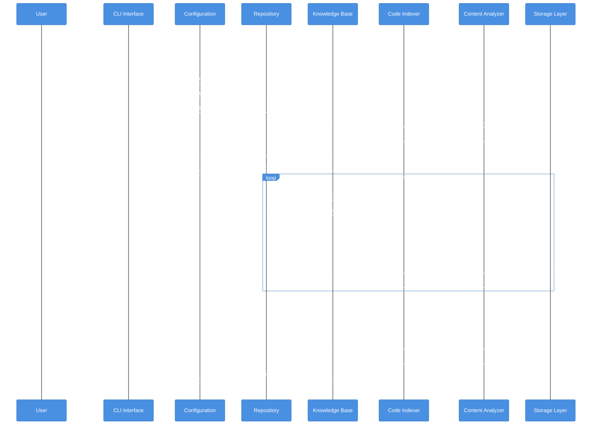
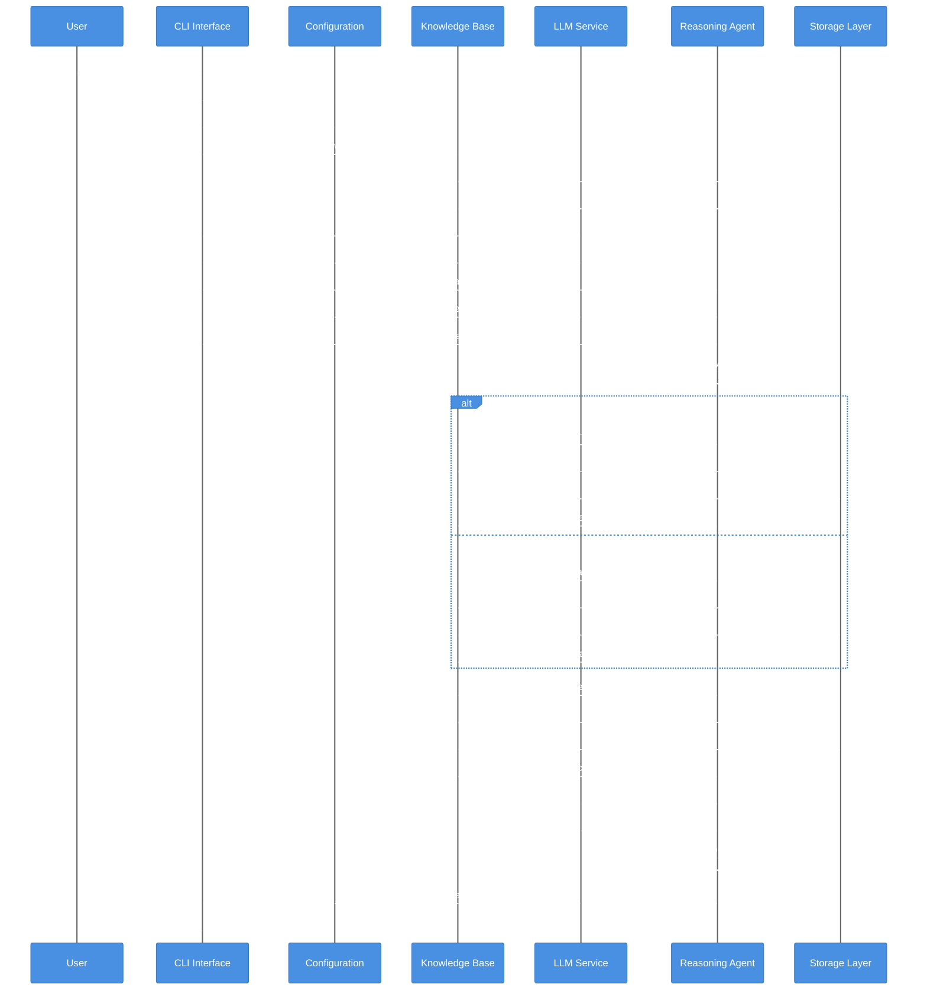

# CodeFusion Workflow Diagrams

## 1. Repository Exploration and Indexing Workflow

## 2. Query Processing Workflow

## Key Components Interaction Summary

### Exploration Workflow Key Points:
1. **Configuration Loading**: System loads user settings and preferences
2. **Repository Access**: Scans and analyzes repository structure
3. **Knowledge Base Setup**: Initializes storage layer (Neo4j or Vector DB)
4. **Content Analysis**: Extracts code entities and relationships
5. **Persistent Storage**: Saves structured knowledge for future queries

### Query Workflow Key Points:
1. **Query Analysis**: Processes natural language questions
2. **Multi-Strategy Search**: Uses vector similarity and graph traversal
3. **Context Enrichment**: Gathers related entities and relationships
4. **LLM Integration**: Generates comprehensive answers with context
5. **Response Delivery**: Returns structured answers with supporting evidence

Both workflows support dual storage backends (Neo4j for graph analytics, Vector DB for semantic search) with automatic fallback capabilities.