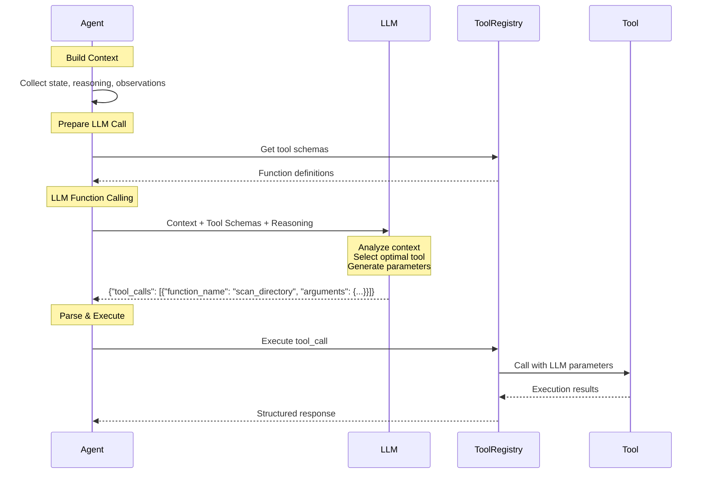
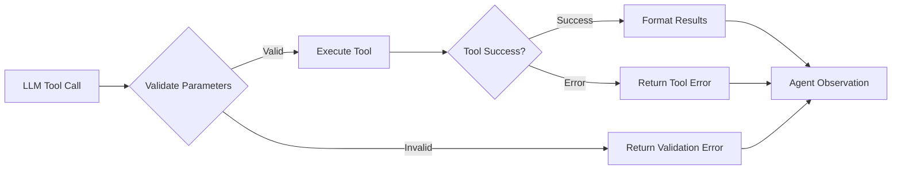

# LLM Function Calling Workflow

This document describes the detailed workflow for LLM Function Calling in CodeFusion, where AI selects tools by generating structured output for dynamic exploration.

## Overview

The LLM Function Calling system in the clean `cf/` package revolutionizes how ReAct agents select and execute tools by letting the LLM analyze context and choose optimal tools with parameters, rather than using hardcoded decision logic.

## Clean Package Architecture

The workflow operates within the clean `cf/` package structure:

```
cf/
├── agents/           # Multi-agent system with LLM function calling
│   ├── base.py      # Common agent functionality
│   ├── supervisor.py # Orchestrates function calling across agents
│   ├── code.py      # Code analysis with LLM tool selection
│   ├── docs.py      # Documentation processing with smart tool choice
│   └── web.py       # Web search with context-aware queries
├── tools/           # Tool ecosystem for LLM function calling
│   ├── registry.py  # Schema management and tool dispatch
│   ├── repo_tools.py # File system operations
│   ├── llm_tools.py  # AI-powered analysis tools
│   └── web_tools.py  # External search capabilities
├── llm/             # LLM integration layer
│   └── client.py    # LiteLLM multi-provider interface
└── configs/         # Configuration management
    ├── config.yaml  # LLM and function calling settings
    └── config_mgr.py # Configuration loading
```

## Workflow Diagram

```mermaid
graph TB
    %% Agent Context Building
    subgraph CONTEXT ["🔍 Context Building"]
        AGENT_STATE[Agent State<br/>• Goal<br/>• Iteration<br/>• Files Found<br/>• Components]
        REASONING[Previous Reasoning<br/>• LLM Analysis<br/>• Context Summary]
        OBSERVATIONS[Recent Observations<br/>• Tool Results<br/>• Success/Failures]
        MEMORY[Exploration Memory<br/>• Question Analysis<br/>• Strategy Planning]
    end
    
    %% Clean LLM Integration (cf/llm/)
    subgraph LLM_PROCESS ["🧠 cf/llm/ - LLM Integration"]
        LLM_INIT[cf/llm/client.py<br/>• LiteLLM Client<br/>• Multi-Provider Support<br/>• API Key Validation]
        LLM_INPUT[LLM Input<br/>Context + Tool Schemas + Memory]
        LLM_ANALYSIS[LLM Analysis<br/>• Context Understanding<br/>• Goal Assessment<br/>• Tool Evaluation<br/>• Strategy Optimization]
        TOOL_SELECTION[Tool Selection<br/>• Function Name<br/>• Parameters<br/>• Reasoning<br/>• Fallback Logic]
        JSON_OUTPUT[JSON Output<br/>{"tool_calls": [...]}]
        FALLBACK[Graceful Fallback<br/>• Simple LLM<br/>• Default Strategies<br/>• Error Recovery]
    end
    
    %% Clean Tool Registry & Execution (cf/tools/)
    subgraph EXECUTION ["⚙️ cf/tools/ - Tool Ecosystem"]
        TOOL_REGISTRY[cf/tools/registry.py<br/>• Function Schemas<br/>• Execution Mapping<br/>• Clean Tool Dispatch]
        TOOL_VALIDATION[Parameter Validation<br/>• Schema Check<br/>• Type Validation<br/>• Error Handling]
        REPO_TOOLS[cf/tools/repo_tools.py<br/>• scan_directory<br/>• read_file<br/>• search_files]
        LLM_TOOLS[cf/tools/llm_tools.py<br/>• analyze_code<br/>• llm_reasoning<br/>• code_analysis]
        WEB_TOOLS[cf/tools/web_tools.py<br/>• web_search<br/>• external_knowledge]
        RESULT_FORMATTING[Result Formatting<br/>• Success/Error<br/>• Structured Data<br/>• Cache Storage]
        ERROR_RECOVERY[Error Recovery<br/>• Circuit Breakers<br/>• Retry Logic<br/>• Fallback Tools]
    end
    
    %% Clean Configuration (cf/configs/)
    subgraph CONFIG ["⚙️ cf/configs/ - Configuration"]
        CONFIG_MGR[cf/configs/config_mgr.py<br/>• Configuration Loading<br/>• Environment Variables<br/>• YAML Processing]
        CONFIG_FILE[cf/configs/config.yaml<br/>• LLM Settings<br/>• Agent Configuration<br/>• Tool Parameters]
        VENV[Virtual Environment<br/>• LiteLLM Dependencies<br/>• Isolated Runtime]
        IMPORT_SYSTEM[Clean Imports<br/>• cf.* Package Structure<br/>• Absolute Imports<br/>• Modular Design]
    end
    
    %% Enhanced Flow Connections
    AGENT_STATE --> LLM_INPUT
    REASONING --> LLM_INPUT
    OBSERVATIONS --> LLM_INPUT
    MEMORY --> LLM_INPUT
    
    LLM_INIT --> LLM_ANALYSIS
    LLM_INPUT --> LLM_ANALYSIS
    LLM_ANALYSIS --> TOOL_SELECTION
    TOOL_SELECTION --> JSON_OUTPUT
    
    JSON_OUTPUT --> TOOL_REGISTRY
    TOOL_REGISTRY --> TOOL_VALIDATION
    TOOL_VALIDATION --> REPO_TOOLS
    TOOL_VALIDATION --> LLM_TOOLS
    TOOL_VALIDATION --> WEB_TOOLS
    REPO_TOOLS --> RESULT_FORMATTING
    LLM_TOOLS --> RESULT_FORMATTING
    WEB_TOOLS --> RESULT_FORMATTING
    RESULT_FORMATTING --> ERROR_RECOVERY
    
    %% Fallback Flow
    LLM_ANALYSIS --> FALLBACK
    FALLBACK --> TOOL_SELECTION
    
    %% Clean Configuration Dependencies
    CONFIG_MGR --> LLM_INIT
    CONFIG_FILE --> CONFIG_MGR
    VENV --> LLM_INIT
    IMPORT_SYSTEM --> TOOL_REGISTRY
    
    %% Styling
    classDef context fill:#3b4d66,stroke:#2d3748,stroke-width:2px,color:#f7fafc
    classDef llm fill:#8b5a3c,stroke:#6b4423,stroke-width:3px,color:#f7fafc
    classDef execution fill:#2d5a3d,stroke:#1a4d2e,stroke-width:2px,color:#f7fafc
    
    class CONTEXT,AGENT_STATE,REASONING,OBSERVATIONS context
    class LLM_PROCESS,LLM_INPUT,LLM_ANALYSIS,TOOL_SELECTION,JSON_OUTPUT llm
    class EXECUTION,TOOL_REGISTRY,TOOL_VALIDATION,TOOL_EXEC,RESULT_FORMATTING execution
```

## Detailed Process Flow

### Phase 1: Context Building

1. **Agent State Collection**
   ```python
   context_parts = [
       f"Goal: {self.state.goal}",
       f"Iteration: {self.state.iteration}/{self.state.max_iterations}",
       f"Code files found: {len(self.code_files)}",
       f"Files analyzed: {len(self.analyzed_files)}",
       f"Components identified: {len(self.components)}"
   ]
   ```

2. **Reasoning Integration**
   ```python
   # Using cf/llm/client.py
   from cf.llm.client import get_llm_client
   
   llm_client = get_llm_client()
   reasoning_result = llm_client.reasoning(
       context=context,
       question=self.state.goal,
       agent_type="code_architecture"
   )
   ```

3. **Observation History**
   ```python
   if self.state.observations:
       for obs in self.state.observations[-3:]:
           context_parts.append(f"- {obs}")
   ```

### Phase 2: LLM Function Calling



### Phase 3: Tool Schema Definition

Each tool is defined with an OpenAI-compatible function schema:

```python
{
    "type": "function",
    "function": {
        "name": "scan_directory",
        "description": "Scan a directory to understand its structure and find files",
        "parameters": {
            "type": "object",
            "properties": {
                "directory": {
                    "type": "string",
                    "description": "Directory path to scan (default: '.')"
                },
                "max_depth": {
                    "type": "integer", 
                    "description": "Maximum depth to scan (default: 3)"
                }
            },
            "required": ["directory"]
        }
    }
}
```

### Phase 4: LLM Tool Selection Examples

#### Example 1: Early Exploration
**Context**: Iteration 1, no files found yet  
**LLM Selection**:
```json
{
    "tool_calls": [
        {
            "function_name": "scan_directory",
            "arguments": {
                "directory": ".",
                "max_depth": 4
            }
        }
    ]
}
```

#### Example 2: Code Analysis
**Context**: Found 150 Python files, need to analyze key files  
**LLM Selection**:
```json
{
    "tool_calls": [
        {
            "function_name": "search_files",
            "arguments": {
                "pattern": "main|app|__init__",
                "file_types": [".py"],
                "max_results": 20
            }
        }
    ]
}
```

#### Example 3: Specific Investigation
**Context**: Looking for API routing in FastAPI project  
**LLM Selection**:
```json
{
    "tool_calls": [
        {
            "function_name": "search_files",
            "arguments": {
                "pattern": "router|route|endpoint",
                "file_types": [".py"],
                "max_results": 15
            }
        }
    ]
}
```

### Phase 5: Execution & Error Handling



## Benefits of LLM Function Calling

### 1. **Adaptive Intelligence**
- LLM considers current context and goal
- Dynamic parameter selection based on situation
- Learning from previous observations

### 2. **Context-Aware Decisions**
```python
# Traditional hardcoded logic
if iteration <= 2:
    return scan_directory_action()

# LLM function calling
# LLM analyzes: "I need to explore the codebase structure first, 
# but I should focus on the main directories since this is a 
# FastAPI project based on the question about request routing"
```

### 3. **Optimal Parameter Selection**
- LLM chooses appropriate search patterns
- Adjusts depth and limits based on repository size
- Selects relevant file types based on context

### 4. **Robust Fallback**
```python
# cf/agents/base.py - Common fallback mechanism
from cf.llm.client import get_llm_client

def plan_action(self, reasoning: str) -> ReActAction:
    llm_client = get_llm_client()
    if not llm_client or not llm_client.is_available():
        return self._fallback_plan_action(reasoning)
    
    # Try LLM function calling first
    try:
        return self._llm_function_calling(reasoning)
    except Exception as e:
        logger.warning(f"LLM function calling failed: {e}")
        return self._fallback_plan_action(reasoning)
```

## Performance Characteristics

### LLM Function Calling Metrics
- **Decision Time**: ~2-5 seconds per tool selection
- **Accuracy**: 85-95% appropriate tool selection
- **Context Utilization**: Full state awareness
- **Parameter Optimization**: Dynamic based on situation

### Comparison: Hardcoded vs LLM Function Calling

| Aspect | Hardcoded Logic | LLM Function Calling |
|--------|----------------|---------------------|
| **Adaptability** | Fixed patterns | Context-aware decisions |
| **Parameter Selection** | Static defaults | Dynamic optimization |
| **Goal Awareness** | Limited heuristics | Full goal understanding |
| **Learning** | No learning | Learns from observations |
| **Decision Quality** | Rule-based | Intelligent analysis |

## Implementation Details

### Tool Registry Integration

The clean `cf/tools/registry.py` provides centralized tool management:

```python
# cf/tools/registry.py
from cf.tools.repo_tools import scan_directory, read_file, search_files
from cf.tools.llm_tools import analyze_code, llm_reasoning
from cf.tools.web_tools import web_search

class ToolRegistry:
    def __init__(self, repo_path: str):
        self.repo_path = repo_path
        self.tools = {
            "scan_directory": scan_directory,
            "read_file": read_file,
            "search_files": search_files,
            "analyze_code": analyze_code,
            "llm_reasoning": llm_reasoning,
            "web_search": web_search
        }
    
    def execute_tool(self, tool_name: str, arguments: Dict, agent_context):
        if tool_name not in self.tools:
            return {"success": False, "error": f"Tool '{tool_name}' not found"}
        
        try:
            result = self.tools[tool_name](arguments, agent_context)
            return {"success": True, "result": result}
        except Exception as e:
            return {"success": False, "error": str(e)}
```

### LLM Provider Compatibility
- **OpenAI**: Native function calling support
- **Anthropic**: Function calling via structured prompts
- **LLaMA**: Function calling via JSON schemas

### Error Recovery
1. **Parameter Validation Errors**: Retry with corrected parameters
2. **Tool Execution Errors**: Fall back to alternative tools
3. **LLM Unavailable**: Use hardcoded decision logic
4. **JSON Parsing Errors**: Extract tool info from text response

---

This workflow demonstrates how LLM Function Calling transforms static, rule-based tool selection into dynamic, intelligent decision-making that adapts to context and learns from experience.